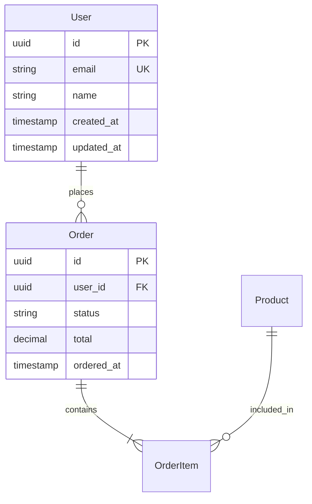

# Data Model Design

## Overview

**Purpose:** [What this data model supports] **Scope:** [Bounded context/domain]
**Database Type:** PostgreSQL | MySQL | MongoDB | DynamoDB | Redis

## Entity Relationship Diagram



## Schema Definitions

### SQL Databases

#### Tables

```sql
-- Users table
CREATE TABLE users (
    id UUID PRIMARY KEY DEFAULT gen_random_uuid(),
    email VARCHAR(255) UNIQUE NOT NULL,
    name VARCHAR(255) NOT NULL,
    password_hash VARCHAR(255) NOT NULL,
    status VARCHAR(50) DEFAULT 'active',
    metadata JSONB,
    created_at TIMESTAMP DEFAULT CURRENT_TIMESTAMP,
    updated_at TIMESTAMP DEFAULT CURRENT_TIMESTAMP
);

-- Add check constraints
ALTER TABLE users ADD CONSTRAINT email_format
    CHECK (email ~* '^[A-Za-z0-9._%+-]+@[A-Za-z0-9.-]+\.[A-Z|a-z]{2,}$');

ALTER TABLE users ADD CONSTRAINT status_values
    CHECK (status IN ('active', 'inactive', 'suspended', 'deleted'));
```

#### Indexes

```sql
-- Performance indexes
CREATE INDEX idx_users_email ON users(email);
CREATE INDEX idx_users_status ON users(status) WHERE status != 'deleted';
CREATE INDEX idx_users_created_at ON users(created_at DESC);

-- Full-text search
CREATE INDEX idx_users_name_search ON users USING GIN (to_tsvector('english', name));

-- JSON indexes (PostgreSQL)
CREATE INDEX idx_users_metadata ON users USING GIN (metadata);
```

### NoSQL Databases

#### MongoDB Schema

```javascript
// User collection
{
  _id: ObjectId,
  email: { type: String, unique: true, required: true },
  name: { type: String, required: true },
  profile: {
    avatar: String,
    bio: String,
    preferences: Map
  },
  addresses: [{
    type: { type: String, enum: ['home', 'work', 'other'] },
    street: String,
    city: String,
    country: String,
    isDefault: Boolean
  }],
  createdAt: Date,
  updatedAt: Date
}

// Indexes
db.users.createIndex({ email: 1 }, { unique: true })
db.users.createIndex({ "addresses.city": 1 })
db.users.createIndex({ createdAt: -1 })
```

#### DynamoDB Schema

```yaml
Table: Users
PartitionKey: userId (String)
SortKey: none

GlobalSecondaryIndexes:
  - IndexName: EmailIndex
    PartitionKey: email (String)
    Projection: ALL

  - IndexName: CreatedDateIndex
    PartitionKey: yearMonth (String)
    SortKey: createdAt (Number)
    Projection: KEYS_ONLY

Attributes:
  userId: String
  email: String
  name: String
  profile: Map
  createdAt: Number
  updatedAt: Number
  ttl: Number (optional, for expiration)
```

## Data Types & Constraints

### Field Specifications

| Field      | Type          | Constraints             | Default        | Description         |
| ---------- | ------------- | ----------------------- | -------------- | ------------------- |
| id         | UUID/ObjectId | PRIMARY KEY             | auto-generated | Unique identifier   |
| email      | String(255)   | UNIQUE, NOT NULL, EMAIL | -              | User email          |
| status     | Enum          | NOT NULL                | 'active'       | Account status      |
| balance    | Decimal(10,2) | >= 0                    | 0.00           | Account balance     |
| metadata   | JSON          | -                       | {}             | Flexible attributes |
| created_at | Timestamp     | NOT NULL                | NOW()          | Creation time       |

### Enums & Constants

```typescript
enum UserStatus {
  ACTIVE = 'active',
  INACTIVE = 'inactive',
  SUSPENDED = 'suspended',
  DELETED = 'deleted',
}

enum OrderStatus {
  PENDING = 'pending',
  PROCESSING = 'processing',
  SHIPPED = 'shipped',
  DELIVERED = 'delivered',
  CANCELLED = 'cancelled',
}
```

## Relationships

### One-to-Many

```sql
-- User has many Orders
ALTER TABLE orders ADD CONSTRAINT fk_orders_user
    FOREIGN KEY (user_id) REFERENCES users(id)
    ON DELETE CASCADE;
```

### Many-to-Many

```sql
-- Users have many Roles
CREATE TABLE user_roles (
    user_id UUID REFERENCES users(id) ON DELETE CASCADE,
    role_id UUID REFERENCES roles(id) ON DELETE CASCADE,
    assigned_at TIMESTAMP DEFAULT CURRENT_TIMESTAMP,
    PRIMARY KEY (user_id, role_id)
);
```

### Polymorphic

```sql
-- Comments on multiple entities
CREATE TABLE comments (
    id UUID PRIMARY KEY,
    commentable_type VARCHAR(50), -- 'Post', 'Product', 'User'
    commentable_id UUID,
    content TEXT,
    INDEX idx_commentable (commentable_type, commentable_id)
);
```

## Migration Strategy

### Version 1 → Version 2

```sql
-- Step 1: Add new column (backward compatible)
ALTER TABLE users ADD COLUMN phone VARCHAR(20);

-- Step 2: Backfill data
UPDATE users SET phone = metadata->>'phone'
WHERE metadata->>'phone' IS NOT NULL;

-- Step 3: Add constraints (after backfill)
ALTER TABLE users ALTER COLUMN phone SET NOT NULL;
ALTER TABLE users ADD CONSTRAINT phone_format
    CHECK (phone ~ '^\+?[1-9]\d{1,14}$');

-- Step 4: Clean up old structure
UPDATE users SET metadata = metadata - 'phone';
```

### Rollback Plan

```sql
-- Rollback Step 1: Copy data back
UPDATE users SET metadata = jsonb_set(metadata, '{phone}', to_jsonb(phone))
WHERE phone IS NOT NULL;

-- Rollback Step 2: Drop new column
ALTER TABLE users DROP COLUMN phone;
```

## Performance Considerations

### Query Patterns

```sql
-- Common query 1: Find user by email
SELECT * FROM users WHERE email = ?;
-- Optimized by: idx_users_email

-- Common query 2: Recent active users
SELECT * FROM users
WHERE status = 'active'
  AND created_at > NOW() - INTERVAL '30 days'
ORDER BY created_at DESC;
-- Optimized by: idx_users_status, idx_users_created_at

-- Common query 3: Full-text search
SELECT * FROM users
WHERE to_tsvector('english', name) @@ plainto_tsquery(?);
-- Optimized by: idx_users_name_search
```

### Denormalization Decisions

```sql
-- Denormalized for read performance
ALTER TABLE orders ADD COLUMN user_email VARCHAR(255);
ALTER TABLE orders ADD COLUMN user_name VARCHAR(255);

-- Kept in sync via trigger
CREATE TRIGGER sync_user_info
AFTER UPDATE ON users
FOR EACH ROW EXECUTE FUNCTION update_order_user_info();
```

## Data Privacy & Security

### PII Fields

⚠️ **Contains PII - Handle with care:**

- `users.email` - Personal identifier
- `users.name` - Personal information
- `users.phone` - Contact information
- `addresses.*` - Location data
- `payment_methods.*` - Financial data

### Encryption

```sql
-- Encrypt sensitive columns at rest
ALTER TABLE users ADD COLUMN email_encrypted BYTEA;
ALTER TABLE users ADD COLUMN phone_encrypted BYTEA;

-- Use application-level encryption
-- Key rotation strategy required
```

### Data Retention

```sql
-- Soft delete with retention period
ALTER TABLE users ADD COLUMN deleted_at TIMESTAMP;
ALTER TABLE users ADD COLUMN purge_after TIMESTAMP;

-- Automated purge job
DELETE FROM users
WHERE deleted_at IS NOT NULL
  AND purge_after < CURRENT_TIMESTAMP;
```

### Audit Trail

```sql
CREATE TABLE audit_log (
    id SERIAL PRIMARY KEY,
    table_name VARCHAR(50),
    record_id UUID,
    action VARCHAR(10), -- INSERT, UPDATE, DELETE
    changed_by UUID,
    changed_at TIMESTAMP DEFAULT CURRENT_TIMESTAMP,
    old_values JSONB,
    new_values JSONB
);
```

## Caching Strategy

### Redis Keys

```yaml
# User cache
Key: user:{userId}
TTL: 3600 seconds
Invalidate: On user update

# User by email
Key: user:email:{email}
TTL: 3600 seconds
Invalidate: On user update

# Query cache
Key: users:active:page:{pageNum}
TTL: 300 seconds
Invalidate: On any user change
```

### Cache-aside Pattern

```typescript
async function getUser(id: string): Promise<User> {
  // Check cache first
  const cached = await redis.get(`user:${id}`);
  if (cached) return JSON.parse(cached);

  // Database fallback
  const user = await db.query('SELECT * FROM users WHERE id = ?', [id]);

  // Cache for next time
  await redis.setex(`user:${id}`, 3600, JSON.stringify(user));
  return user;
}
```

## Monitoring & Observability

### Key Metrics

- Table sizes and growth rate
- Index usage statistics
- Query performance (p50, p95, p99)
- Cache hit ratio
- Connection pool utilization

### Slow Query Log

```sql
-- PostgreSQL: Enable slow query logging
ALTER SYSTEM SET log_min_duration_statement = 100; -- Log queries > 100ms
SELECT pg_reload_conf();
```

### Health Checks

```sql
-- Table statistics
SELECT
    schemaname,
    tablename,
    pg_size_pretty(pg_total_relation_size(schemaname||'.'||tablename)) AS size,
    n_live_tup AS row_count
FROM pg_stat_user_tables
ORDER BY pg_total_relation_size(schemaname||'.'||tablename) DESC;
```

## Testing Data

### Test Fixtures

```sql
-- Test data generator
INSERT INTO users (email, name, status)
SELECT
    'test' || generate_series || '@example.com',
    'Test User ' || generate_series,
    CASE WHEN random() > 0.1 THEN 'active' ELSE 'inactive' END
FROM generate_series(1, 1000);
```

### Data Scenarios

- Empty tables
- Single record
- Small dataset (100 records)
- Medium dataset (10,000 records)
- Large dataset (1,000,000 records)
- Edge cases (max field lengths, special characters)

## Documentation Links

- [Database Documentation]()
- [ORM/ODM Models]()
- [API Schema Documentation]()
- [Migration History]()

## Change Log

| Version | Date       | Changes             | Author |
| ------- | ---------- | ------------------- | ------ |
| 1.0.0   | YYYY-MM-DD | Initial schema      | Name   |
| 1.1.0   | YYYY-MM-DD | Added user roles    | Name   |
| 1.2.0   | YYYY-MM-DD | Performance indexes | Name   |
