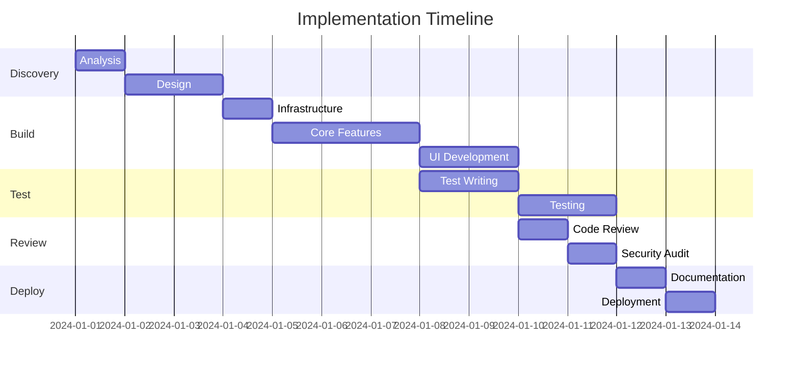

# Implementation Plan

## Goal

**Objective:** [Clear statement of what needs to be achieved] **Success
Criteria:** [How we know it's complete and working] **Timeline:** [Estimated
duration or deadline]

## Context & Constraints

### Current State

- [What exists today]
- [Existing patterns to follow]
- [Technical debt to consider]

### Constraints

- **Technical:** [Framework limitations, compatibility requirements]
- **Business:** [Deadlines, budget, regulations]
- **Resources:** [Team availability, skill sets]

### Assumptions

- [What we're assuming is true]
- [Dependencies we expect to be available]

## Execution Plan

### Phase 1: Discovery & Design

**Duration:** [X hours/days] **Owner:** Architect

1. **Analyze existing codebase**
   - [ ] Identify patterns and conventions
   - [ ] Review similar features
   - [ ] Document tech stack

2. **Design solution architecture**
   - [ ] Define interfaces and contracts
   - [ ] Plan data model changes
   - [ ] Identify integration points

**Deliverables:**

- Architecture design document
- Interface specifications
- Risk assessment

### Phase 2: Implementation

**Duration:** [X hours/days] **Owner:** Coder

3. **Set up infrastructure**
   - [ ] Create necessary files/folders
   - [ ] Add dependencies
   - [ ] Configure build tools

4. **Build core functionality**
   - [ ] Implement data models
   - [ ] Create service layer
   - [ ] Build API endpoints

5. **Develop UI components**
   - [ ] Create presentational components
   - [ ] Wire up state management
   - [ ] Connect to backend

**Deliverables:**

- Working code
- Unit tests
- Basic documentation

### Phase 3: Testing & Validation

**Duration:** [X hours/days] **Owner:** Tester

6. **Write comprehensive tests**
   - [ ] Unit tests for business logic
   - [ ] Integration tests for APIs
   - [ ] E2E tests for critical paths

7. **Perform validation**
   - [ ] Verify acceptance criteria
   - [ ] Test edge cases
   - [ ] Check performance

**Deliverables:**

- Test suite
- Test report
- Bug list

### Phase 4: Review & Security

**Duration:** [X hours/days] **Owner:** Reviewer, Security-Auditor

8. **Code review**
   - [ ] Review implementation
   - [ ] Check patterns and conventions
   - [ ] Verify test coverage

9. **Security audit**
   - [ ] Check authentication/authorization
   - [ ] Review data handling
   - [ ] Scan dependencies

**Deliverables:**

- Review feedback
- Security report
- Required fixes

### Phase 5: Documentation & Deployment

**Duration:** [X hours/days] **Owner:** Docs-Writer

10. **Complete documentation**
    - [ ] Update README
    - [ ] Document APIs
    - [ ] Create user guides

11. **Prepare deployment**
    - [ ] Migration scripts
    - [ ] Configuration updates
    - [ ] Rollback plan

**Deliverables:**

- Documentation
- Deployment guide
- Runbook

## Task Dependencies

## Risk Mitigation

| Risk                 | Probability     | Impact          | Mitigation                |
| -------------------- | --------------- | --------------- | ------------------------- |
| [Risk description]   | Low/Medium/High | Low/Medium/High | [How to handle]           |
| Unknown dependencies | Medium          | High            | Discovery phase first     |
| Scope creep          | High            | Medium          | Clear acceptance criteria |
| Performance issues   | Low             | High            | Load testing in phase 3   |

## Success Metrics

### Functional Metrics

- [ ] All acceptance criteria met
- [ ] Zero critical bugs
- [ ] Test coverage > 80%

### Performance Metrics

- [ ] Response time < 200ms
- [ ] Page load < 3 seconds
- [ ] Memory usage stable

### Quality Metrics

- [ ] Code review approved
- [ ] Security audit passed
- [ ] Documentation complete

## Delegation Matrix

| Task           | Primary Owner    | Support         | Approver      |
| -------------- | ---------------- | --------------- | ------------- |
| Architecture   | Architect        | Product-Manager | Tech Lead     |
| Implementation | Coder            | Architect       | Reviewer      |
| Testing        | Tester           | Coder           | QA Lead       |
| Security       | Security-Auditor | Coder           | Security Team |
| Documentation  | Docs-Writer      | Coder           | Product       |

## Communication Plan

### Status Updates

- **Daily:** Slack thread with progress
- **Weekly:** Team sync on blockers
- **Phase Completion:** Stakeholder demo

### Escalation Path

1. Blocker identified → Team Lead
2. Scope change → Product Manager
3. Security issue → Security Team
4. Timeline risk → Project Manager

## Definition of Done

### Code Complete

- [ ] Feature implemented
- [ ] Tests written and passing
- [ ] Code reviewed and approved
- [ ] Documentation updated

### Ready for Production

- [ ] Security audit passed
- [ ] Performance validated
- [ ] Monitoring configured
- [ ] Rollback plan tested

## Follow-up Actions

### Immediate Next Steps

1. [First action to take]
2. [Second action to take]
3. [Third action to take]

### Post-Implementation

- [ ] Monitor metrics
- [ ] Gather user feedback
- [ ] Plan optimization phase
- [ ] Schedule retrospective

## References

- [Link to requirements]
- [Link to design docs]
- [Link to related PRs]
- [Link to dependencies]
