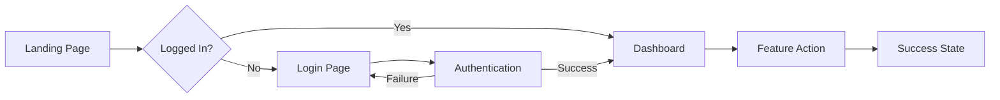

# UI/UX Design Specification

## Feature Overview

**Feature Name:** [Name] **User Story:** As a [user type], I want to [action] so
that [benefit] **Design System:** Material UI | Ant Design | Bootstrap |
Tailwind | Custom

## User Flows

### Primary Flow



### User Journey Steps

1. **Entry Point**: User arrives from [source]
2. **Authentication**: Check if logged in
3. **Navigation**: User clicks on [element]
4. **Action**: User performs [action]
5. **Feedback**: System shows [response]
6. **Exit**: User completes flow or navigates away

## Component Architecture

### Component Hierarchy

```
Page/
├── Header/
│   ├── Logo
│   ├── Navigation
│   └── UserMenu
├── Main/
│   ├── Sidebar/
│   │   ├── FilterPanel
│   │   └── ActionButtons
│   ├── Content/
│   │   ├── SearchBar
│   │   ├── DataGrid
│   │   └── Pagination
│   └── DetailPanel/
└── Footer/
```

### Component Specifications

#### SearchBar Component

```typescript
interface SearchBarProps {
  placeholder?: string;
  value: string;
  onChange: (value: string) => void;
  onSearch: (query: string) => void;
  suggestions?: string[];
  isLoading?: boolean;
}

// Usage
<SearchBar
  placeholder="Search users..."
  value={searchQuery}
  onChange={setSearchQuery}
  onSearch={handleSearch}
  isLoading={isSearching}
/>
```

#### DataGrid Component

```typescript
interface DataGridProps<T> {
  data: T[];
  columns: Column<T>[];
  onSort?: (field: keyof T, direction: 'asc' | 'desc') => void;
  onSelect?: (item: T) => void;
  selectable?: boolean;
  loading?: boolean;
  emptyMessage?: string;
}
```

## UI States

### Loading States

```typescript
// Skeleton loader pattern
<div className="skeleton">
  <div className="skeleton-header" />
  <div className="skeleton-body">
    {[...Array(5)].map((_, i) => (
      <div key={i} className="skeleton-row" />
    ))}
  </div>
</div>
```

### Empty States

```typescript
<EmptyState
  icon={<SearchIcon />}
  title="No results found"
  description="Try adjusting your search or filters"
  action={
    <Button onClick={clearFilters}>Clear filters</Button>
  }
/>
```

### Error States

```typescript
<ErrorBoundary
  fallback={
    <ErrorState
      title="Something went wrong"
      description={error.message}
      action={
        <Button onClick={retry}>Try again</Button>
      }
    />
  }
>
  {children}
</ErrorBoundary>
```

### Success States

```typescript
<Toast
  type="success"
  message="Changes saved successfully"
  duration={3000}
  action={{
    label: "Undo",
    onClick: handleUndo
  }}
/>
```

## Layout & Responsive Design

### Breakpoints

```css
/* Mobile First Approach */
/* Default: Mobile (320px - 767px) */
/* Tablet: 768px - 1023px */
@media (min-width: 768px) {
}
/* Desktop: 1024px - 1439px */
@media (min-width: 1024px) {
}
/* Wide: 1440px+ */
@media (min-width: 1440px) {
}
```

### Grid System

```typescript
// 12-column grid
<Grid container spacing={2}>
  <Grid item xs={12} sm={6} md={4} lg={3}>
    <Card />
  </Grid>
</Grid>
```

### Responsive Behavior

| Component  | Mobile         | Tablet             | Desktop        |
| ---------- | -------------- | ------------------ | -------------- |
| Navigation | Hamburger menu | Hamburger menu     | Full nav bar   |
| Sidebar    | Hidden/Modal   | Collapsible        | Always visible |
| Data Grid  | Cards          | Table (scrollable) | Full table     |
| Forms      | Single column  | Single column      | Multi-column   |

## Visual Design

### Color Palette

```css
:root {
  /* Primary Colors */
  --primary-50: #e3f2fd;
  --primary-500: #2196f3;
  --primary-900: #0d47a1;

  /* Neutral Colors */
  --gray-50: #fafafa;
  --gray-500: #9e9e9e;
  --gray-900: #212121;

  /* Semantic Colors */
  --success: #4caf50;
  --warning: #ff9800;
  --error: #f44336;
  --info: #2196f3;
}
```

### Typography

```css
/* Type Scale */
--text-xs: 0.75rem; /* 12px */
--text-sm: 0.875rem; /* 14px */
--text-base: 1rem; /* 16px */
--text-lg: 1.125rem; /* 18px */
--text-xl: 1.25rem; /* 20px */
--text-2xl: 1.5rem; /* 24px */
--text-3xl: 1.875rem; /* 30px */

/* Font Weights */
--font-normal: 400;
--font-medium: 500;
--font-semibold: 600;
--font-bold: 700;
```

### Spacing System

```css
/* 8px base unit */
--space-1: 0.25rem; /* 4px */
--space-2: 0.5rem; /* 8px */
--space-3: 0.75rem; /* 12px */
--space-4: 1rem; /* 16px */
--space-6: 1.5rem; /* 24px */
--space-8: 2rem; /* 32px */
--space-12: 3rem; /* 48px */
```

## Interaction Design

### Animations

```css
/* Transitions */
.button {
  transition: all 200ms ease-in-out;
}

/* Hover States */
.button:hover {
  transform: translateY(-2px);
  box-shadow: 0 4px 8px rgba(0, 0, 0, 0.1);
}

/* Loading Animation */
@keyframes spin {
  to {
    transform: rotate(360deg);
  }
}
.spinner {
  animation: spin 1s linear infinite;
}
```

### Micro-interactions

- **Button Click**: Scale down briefly (95%) then back
- **Form Field Focus**: Border color change, slight shadow
- **Card Hover**: Lift effect with shadow
- **Toggle Switch**: Smooth slide with color transition
- **Tooltip**: Fade in with slight upward movement

## Accessibility (A11y)

### WCAG 2.1 Level AA Compliance

- [ ] Color contrast ratio ≥ 4.5:1 for normal text
- [ ] Color contrast ratio ≥ 3:1 for large text
- [ ] All interactive elements have focus indicators
- [ ] All images have alt text
- [ ] Forms have proper labels

### Keyboard Navigation

```typescript
// Tab order
<div tabIndex={0}>First</div>
<div tabIndex={1}>Second</div>
<div tabIndex={2}>Third</div>

// Skip to main content
<a className="sr-only" href="#main">Skip to main content</a>
```

### ARIA Labels

```html
<!-- Button with icon only -->
<button aria-label="Delete item">
  <TrashIcon />
</button>

<!-- Loading state -->
<div role="status" aria-live="polite">
  <span className="sr-only">Loading...</span>
</div>

<!-- Form validation -->
<input aria-invalid="{hasError}" aria-describedby="email-error" />
<span id="email-error">Please enter a valid email</span>
```

### Screen Reader Support

```typescript
// Announce dynamic content
<div aria-live="polite" aria-atomic="true">
  {statusMessage}
</div>

// Describe relationships
<nav aria-label="Main navigation">
<main role="main" aria-labelledby="page-title">
<aside aria-label="Sidebar">
```

## Forms & Validation

### Form Layout

```typescript
<form onSubmit={handleSubmit}>
  <FormGroup>
    <Label htmlFor="email">Email*</Label>
    <Input
      id="email"
      type="email"
      required
      aria-required="true"
    />
    <HelperText>We'll never share your email</HelperText>
    <ErrorMessage show={errors.email}>
      {errors.email}
    </ErrorMessage>
  </FormGroup>
</form>
```

### Validation Rules

| Field    | Rule                  | Error Message                                          |
| -------- | --------------------- | ------------------------------------------------------ |
| Email    | Valid email format    | "Please enter a valid email address"                   |
| Password | Min 8 chars, 1 number | "Password must be at least 8 characters with 1 number" |
| Phone    | Valid phone format    | "Please enter a valid phone number"                    |
| Required | Not empty             | "This field is required"                               |

### Real-time Validation

- **On Blur**: Validate when user leaves field
- **On Change**: Validate after user stops typing (debounced)
- **On Submit**: Validate all fields before submission

## Performance Considerations

### Optimization Techniques

```typescript
// Lazy loading
const HeavyComponent = lazy(() => import('./HeavyComponent'));

// Virtualization for long lists
<VirtualList
  items={thousandsOfItems}
  renderItem={renderItem}
  height={600}
  itemHeight={50}
/>

// Image optimization

```

### Bundle Size Targets

- Initial load: < 200KB
- Route chunks: < 100KB
- Images: WebP format, responsive sizes
- Fonts: Variable fonts, subset for used characters

## Testing Scenarios

### Visual Testing

- [ ] Component renders correctly at all breakpoints
- [ ] Dark mode compatibility
- [ ] High contrast mode support
- [ ] Print stylesheet

### Interaction Testing

- [ ] All buttons and links are clickable
- [ ] Forms submit correctly
- [ ] Modals open/close properly
- [ ] Drag and drop works (if applicable)

### Device Testing

- [ ] Chrome, Firefox, Safari, Edge
- [ ] iOS Safari, Android Chrome
- [ ] Touch interactions work
- [ ] Orientation changes handled

## Implementation Notes

### Dependencies

```json
{
  "react": "^18.0.0",
  "react-router-dom": "^6.0.0",
  "styled-components": "^5.3.0",
  "@mui/material": "^5.0.0",
  "framer-motion": "^7.0.0"
}
```

### File Structure

```
src/
├── components/
│   ├── common/
│   │   ├── Button/
│   │   ├── Input/
│   │   └── Modal/
│   ├── features/
│   │   └── UserProfile/
│   └── layouts/
│       └── Dashboard/
├── hooks/
├── styles/
└── utils/
```

### Naming Conventions

- Components: PascalCase (`UserProfile.tsx`)
- Utilities: camelCase (`formatDate.ts`)
- Constants: UPPER_SNAKE_CASE (`MAX_FILE_SIZE`)
- CSS classes: kebab-case (`user-profile-card`)

## Handoffs

### → Coder

- Implement components following specifications above
- Use existing design tokens from `src/styles/tokens`
- Follow responsive breakpoints defined
- Ensure all ARIA labels are included

### → Tester

- Test all user flows documented
- Verify accessibility requirements
- Check responsive behavior at all breakpoints
- Test error states and edge cases

### → Product

- Review empty states messaging
- Confirm error messages are user-friendly
- Validate that flow matches requirements
