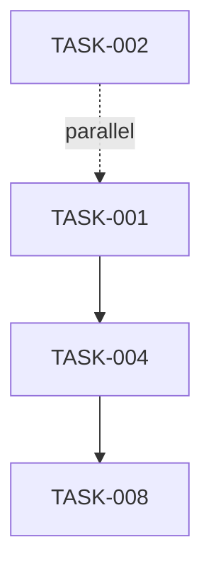
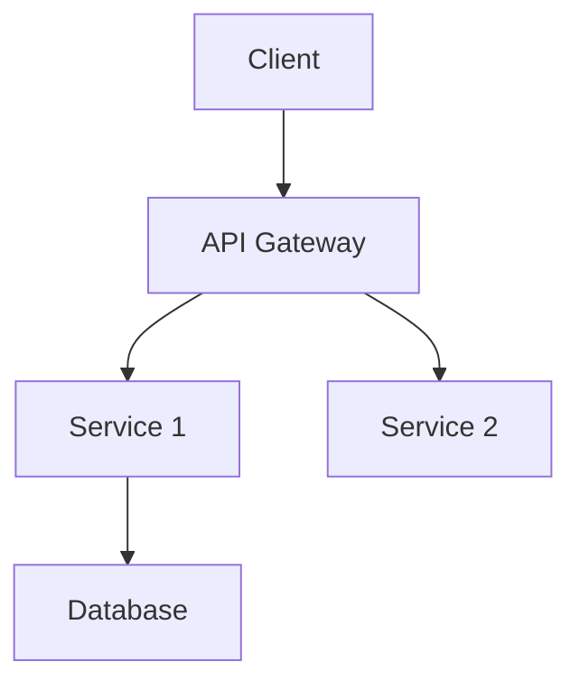
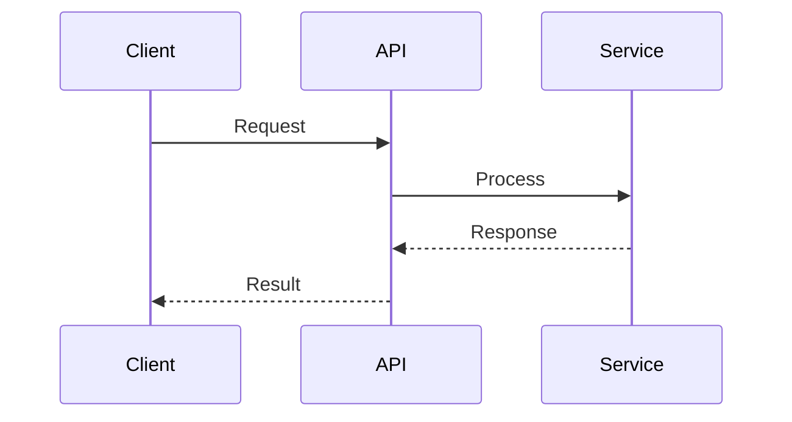
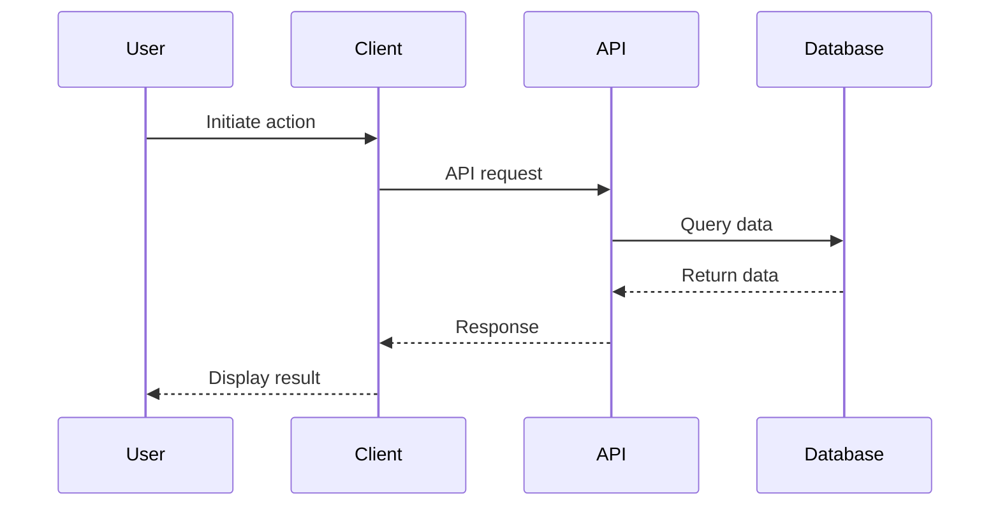

# Comprehensive Adapter Implementation Plan

## Executive Summary

This document provides a comprehensive plan for implementing SpecKit and BMAD
adapters for Anvil, based on thorough analysis of both standards. The plan
ensures proper implementation, extensibility, and addresses all facets of how
these formats impact Anvil usage.

**Key Findings:**

- SpecKit: **3-document format** (spec.md, plan.md, tasks.md) - **Partially
  Implemented** (V2 exists but needs validation)
- BMAD: **Multi-document format** (PRD, Architecture, Stories, Epics, QA) -
  **Not Implemented**
- Both formats have rich metadata and structured relationships
- Significant differences in philosophy and workflow

---

## Table of Contents

1. [Format Analysis](#format-analysis)
2. [Current Implementation Status](#current-implementation-status)
3. [Gap Analysis](#gap-analysis)
4. [Unified Adapter Architecture](#unified-adapter-architecture)
5. [Implementation Roadmap](#implementation-roadmap)
6. [Impact on Anvil Features](#impact-on-anvil-features)
7. [Testing Strategy](#testing-strategy)
8. [Future Extensibility](#future-extensibility)

---

## 1. Format Analysis

### 1.1 SpecKit Format (GitHub Official)

**Philosophy**: Spec-Driven Development with AI agents **Primary Use Case**:
AI-assisted feature development with clear WHAT/WHY/HOW separation

#### Document Structure

**spec.md** - Requirements (WHAT and WHY)

```markdown
# Feature: [Feature Name]

**Branch**: `feature/xxx-name` **Date**: YYYY-MM-DD **Status**: Draft | In
Progress | Review | Complete

## User Scenarios & Testing

### P1: [High Priority Scenario]

**As a** [user type] **I want to** [action] **So that** [benefit]

**Acceptance Scenarios:**

- Given [context], When [action], Then [outcome]

**Edge Cases:**

- [Edge case description]
- [NEEDS CLARIFICATION: question]

### P2: [Medium Priority Scenario]

[Same structure...]

### P3+: [Low Priority Scenarios]

[Same structure...]

## Requirements

### Functional Requirements

**FR-001**: System MUST [requirement] **FR-002**: [NEEDS CLARIFICATION: unclear
requirement]

### Key Entities

**EntityName**

- Represents: [description]
- Key Attributes: [attr1, attr2]
- Relationships: [related entities]

## Success Criteria

### Quantitative Metrics

- [Measurable metric]

### Qualitative Metrics

- [Quality metric]

### Performance Metrics (optional)

- [Performance target]

### Security Metrics (optional)

- [Security requirement]
```

**plan.md** - Implementation (HOW)

```markdown
# Implementation Plan: [Feature Name]

**Branch**: `feature/xxx-name` **Date**: YYYY-MM-DD **Input**:
specs/xxx-feature-name/spec.md

## Summary

[Feature requirements from spec + technical approach]

## Technical Context

- **Language & Version**: [e.g., TypeScript 5.0]
- **Dependencies**: [key libraries]
- **Storage**: [database/storage approach]
- **Testing Framework**: [framework choice]
- **Platform**: [target platform]
- **Project Type**: [CLI, web app, etc.]
- **Performance Goals**: [targets]
- **Constraints**: [limitations]
- **Scale & Scope**: [scale considerations]

## Constitution Check

- **Phase**: Before Phase 0 / After Phase 1
- **Status**: ✅ PASSED / ⚠️ REVIEWED / ❌ BLOCKED
- **Notes**: [evaluation notes]

## Project Structure

### Documentation

- `specs/###-feature-name/plan.md` (this file)
- `specs/###-feature-name/spec.md`
- `specs/###-feature-name/research.md`
- `specs/###-feature-name/data-model.md`
- `specs/###-feature-name/contracts/` (API contracts)
- `specs/###-feature-name/quickstart.md`
- `specs/###-feature-name/tasks.md`

### Source Code

**Option A: Single Project**
```

src/ ├── models/ ├── services/ ├── cli/ └── lib/

```

**Option B: Web Application**
```

backend/ ├── src/ └── tests/ frontend/ ├── src/ └── tests/

```

## Implementation Details
### Database Schema
[Schema details]

### API Endpoints
[Endpoint specifications]

### Component Architecture
[Architecture details]

## Complexity Tracking
| Complexity Item | Justification | Alternatives Rejected |
|-----------------|---------------|----------------------|
| [Item] | [Why needed] | [Why not simpler] |
```

**tasks.md** - Execution Breakdown

````markdown
# Tasks: [Feature Name]

**Input**: specs/###-feature-name/spec.md **Output**: Implemented feature

## Prerequisites

- [ ] spec.md completed and reviewed
- [ ] plan.md completed and reviewed
- [ ] research.md completed
- [ ] data-model.md completed

## Task ID Format

- `TASK-###`: Sequential task number
- `[~]`: Can run in parallel with previous task
- `[STORY-###]`: Links to user story

## Phase 1: Setup

- `TASK-001`: Initialize project structure
- `TASK-002` [~]: Configure linting and formatting
- `TASK-003`: Install core dependencies

## Phase 2: Foundational ⚠️ CRITICAL

- `TASK-004`: Set up database/ORM
- `TASK-005`: Implement authentication middleware
- `TASK-006`: Set up API routing
- `TASK-007`: Implement error handling

**Checkpoint**: Foundational infrastructure complete and tested

## Phase 3: User Stories (P1)

### [STORY-001]: [User Story Title]

**Goal**: [Story goal] **Tests**:

- [ ] Contract tests passing
- [ ] Integration tests passing

**Implementation Tasks**:

- `TASK-008`: [Task description]
- `TASK-009` [~]: [Parallel task]
- `TASK-010`: [Dependent task]

**Checkpoint**: Story independently testable and complete

### [STORY-002]: [Next P1 Story]

[Same structure...]

## Phase 4: User Stories (P2)

[Same structure as Phase 3...]

## Phase 5: Polish & Cross-Cutting Concerns

- `TASK-050`: Complete documentation
- `TASK-051`: Refactor and optimize
- `TASK-052`: Security hardening
- `TASK-053`: Performance validation

## Dependencies & Execution Order


````

## Implementation Strategies

- **MVP First**: Implement P1 stories first
- **Independent Stories**: Each story is independently testable
- **Incremental Delivery**: Deploy stories as completed
- **Team Parallelization**: Multiple stories can be developed concurrently

````

#### Key Characteristics

1. **Priority-Driven**: P1 (high), P2 (medium), P3+ (low)
2. **Clarification Markers**: `[NEEDS CLARIFICATION: ...]` throughout
3. **Independent Testability**: Each user scenario must be independently testable
4. **Constitution Check**: Gating mechanism for architectural decisions
5. **Phase-Based Tasks**: Setup → Foundational → Stories → Polish
6. **Parallel Execution**: Tasks marked with `[~]` can run in parallel

---

### 1.2 BMAD Method Format

**Philosophy**: AI-Agent Framework for Agile Development
**Primary Use Case**: Agent-driven planning with human-in-the-loop validation

#### Document Structure

**PRD (docs/prd.md)** - Product Requirements
```markdown
# Product Requirements Document
**Version**: 2.0
**Date**: YYYY-MM-DD
**Author**: [PM Agent / Human]

## Change Log
| Date | Version | Description | Author |
|------|---------|-------------|--------|
| ... | ... | ... | ... |

## Goals and Background Context
### Goals
- [Desired outcome 1]
- [Desired outcome 2]

### Background Context
[1-2 paragraphs explaining the problem and landscape]

## Requirements
### Functional (FR)
**FR-001**: [Requirement description]
**FR-002**: [Requirement description]

### Non-Functional (NFR)
**NFR-001**: [Requirement description]
**NFR-002**: [Requirement description]

## User Interface Design Goals
### Overall UX Vision
[Vision description]

### Key Interaction Paradigms
[Interaction patterns]

### Core Screens and Views
[High-level screen descriptions]

### Accessibility
- Choice: None | WCAG AA | WCAG AAA

### Branding
[Branding elements]

### Target Platforms
- Choice: Web Responsive | Mobile Only | Desktop Only | Cross-Platform

## Technical Assumptions
### Repository Structure
- Choice: Monorepo | Polyrepo

### Service Architecture
- Choice: Monolith | Microservices | Serverless

### Testing Requirements
- Choice: Unit Only | Unit + Integration | Full Pyramid

### Additional Technical Assumptions
[Other assumptions]

## Epic List
1. **[Epic Title]**: [Single-sentence goal]
2. **[Epic Title]**: [Single-sentence goal]

## Epic Details
### Epic 1: [Title]
**Expanded Goal**: [2-3 sentence description]

**User Stories:**
- **US-001**: As a [user], I want [action], so that [benefit]
- **US-002**: As a [user], I want [action], so that [benefit]

**Acceptance Criteria (US-001):**
1. [Testable condition]
2. [Testable condition]

**Acceptance Criteria (US-002):**
1. [Testable condition]
2. [Testable condition]

### Epic 2: [Title]
[Same structure...]

## Next Steps
- UX Expert: Create detailed UX specification
- Architect: Create architecture document from this PRD
````

**Architecture (docs/architecture.md)** - Technical Design

````markdown
# Architecture Document

**Version**: 2.0 **Date**: YYYY-MM-DD **Author**: [Architect Agent / Human]
**References**: docs/prd.md, docs/front-end-spec.md

## Change Log

| Date | Version | Description | Author |
| ---- | ------- | ----------- | ------ |
| ...  | ...     | ...         | ...    |

## Introduction

### Project Overview

[Overview and relationship to frontend architecture]

### Starter Template Assessment

[Assessment of existing codebase if applicable]

## High-Level Architecture

### Technical Summary

[3-5 sentence overview of architecture style, components, and tech choices]

### High-Level Overview

- **Architectural Style**: [Monolith / Microservices / Serverless]
- **Repository Structure**: [Monorepo / Polyrepo]
- **Service Architecture**: [Details]
- **Data Flows**: [Flow descriptions]

### Project Diagram


````

### Architectural Patterns

**Pattern 1: [Pattern Name]**

- **Option A**: [Description] [RECOMMENDED]
- **Option B**: [Description]
- **Rationale**: [Why Option A chosen]

## Tech Stack (DEFINITIVE - Single Source of Truth)

### Cloud Infrastructure

- **Provider**: [AWS / Azure / GCP]
- **Services**: [List of cloud services]
- **Regions**: [Deployment regions]

### Technology Stack

| Category  | Technology | Version | Purpose            | Rationale             |
| --------- | ---------- | ------- | ------------------ | --------------------- |
| Runtime   | Node.js    | 18.17.0 | Server runtime     | LTS, widely supported |
| Framework | Express    | 4.18.2  | Web framework      | Mature, flexible      |
| Database  | PostgreSQL | 15.3    | Primary data store | ACID, relational      |
| ORM       | Prisma     | 5.0.0   | Database access    | Type-safe, modern     |

**Note**: NO "latest" versions - all pinned explicitly

## Data Models

### Model 1: [Entity Name]

**Purpose**: [Business purpose]

**Attributes**:

- `id`: UUID, Primary Key
- `name`: string, required
- `email`: string, unique, required
- `created_at`: timestamp

**Relationships**:

- One-to-Many with [Other Entity]
- Many-to-Many with [Other Entity] via [Junction Table]

**Design Decisions**:

- [Rationale for key design choices]

### Model 2: [Entity Name]

[Same structure...]

## Components

### Component 1: [Component Name]

**Responsibility**: [Primary purpose]

**Interfaces/APIs**:

- `POST /api/endpoint`: [Description]
- `GET /api/endpoint`: [Description]

**Dependencies**:

- [Component dependencies]

**Technology**: [Specific tech for this component]

**Diagram**:



### Component 2: [Component Name]

[Same structure...]

## External APIs

### API 1: [Service Name]

**Purpose**: [Why we integrate with this] **Documentation**: [URL]
**Authentication**: [Auth method] **Rate Limits**: [Limits] **Endpoints Used**:

- `GET /endpoint`: [Purpose]

### API 2: [Service Name]

[Same structure...]

## Core Workflows

### Workflow 1: [User Journey Name]



**Error Handling**:

- [Error scenarios and handling]

**Async Operations**:

- [Async operation handling]

### Workflow 2: [Another Journey]

[Same structure...]

## REST API Specification

```yaml
openapi: 3.0.0
info:
  title: [Project API]
  version: 1.0.0
paths:
  /api/resource:
    get:
      summary: [Description]
      parameters:
        - name: id
          in: query
          required: true
          schema:
            type: string
      responses:
        '200':
          description: Success
          content:
            application/json:
              schema:
                type: object
                properties:
                  id: { type: string }
                  name: { type: string }
```

## Deployment & Operations

### Deployment Strategy

[Deployment approach]

### Monitoring & Observability

[Monitoring tools and approach]

### Scaling Strategy

[How system scales]

## Security Considerations

[Security design decisions]

## Performance Considerations

[Performance optimizations]

## Next Steps

- Dev Agent: Begin implementation based on this architecture
- QA Agent: Develop test strategy

````

**Story Files (docs/stories/{epic}.{story}.md)** - Individual Stories
```markdown
# Story: [Story Title]
**Epic**: [Epic Name]
**ID**: {epic}.{story}
**Priority**: P0 | P1 | P2

## User Story
As a [user type], I want [action], so that [benefit]

## Acceptance Criteria
1. Given [context], When [action], Then [outcome]
2. Given [context], When [action], Then [outcome]

## Implementation Notes
[Technical implementation details]

## Dev/QA Notes
[Notes that carry forward between iterations]

## Links
- PRD: docs/prd.md
- Architecture: docs/architecture.md
- QA Assessment: docs/qa/assessments/{epic}.{story}-risk-profile-YYYYMMDD.md
````

**QA Assessments (docs/qa/assessments/{epic}.{story}-risk-profile-YYYYMMDD.md)**

```markdown
# Risk Profile: {epic}.{story}

**Date**: YYYY-MM-DD **Story**: [Story title]

## Risk Assessment

| Risk Category | Probability (1-3) | Impact (1-3) | Score (P×I) | Mitigation            |
| ------------- | ----------------- | ------------ | ----------- | --------------------- |
| Security      | 2                 | 3            | 6           | [Mitigation strategy] |
| Performance   | 1                 | 2            | 2           | [Mitigation strategy] |

## Test Strategy

### Unit Tests (P0)

- [Test description]

### Integration Tests (P1)

- [Test description]

### E2E Tests (P2)

- [Test description]

## Requirements Traceability

**FR-001**: [Requirement]

- **Test Coverage**:
  - Given [context]
  - When [action]
  - Then [outcome]

## NFR Validation

**NFR-001**: [Requirement]

- **Evidence**: [How it's validated]
```

**Quality Gates (docs/qa/gates/{epic}.{story}-{slug}.yml)**

```yaml
story: "{epic}.{story}"
gate: "{gate-name}"
status: "PASS" | "CONCERNS" | "FAIL" | "WAIVED"
date: "YYYY-MM-DD"
assessor: "[QA Agent / Human]"

concerns:
  - concern: "[Description]"
    severity: "HIGH" | "MEDIUM" | "LOW"
    recommendation: "[Action needed]"

waiver_reason: "[If status is WAIVED, explain why]"
```

#### Key Characteristics

1. **Agent-Driven**: Analyst, PM, Architect, Dev, QA agents collaborate
2. **YAML Templates**: All documents generated from YAML templates with embedded
   prompts
3. **Validation Workflow**: PO runs master checklist to ensure PRD/Architecture
   alignment
4. **Document Sharding**: PRD/Architecture can be split into individual Epic and
   Story files
5. **QA Integration**: Built-in risk assessment and quality gates
6. **Traceability**: Requirements tracked through stories to tests
7. **Version Control**: Change logs in every document

---

## 2. Current Implementation Status

### 2.1 SpecKit Adapter (V2)

**Location**: `packages/adapters/src/speckit/`

**Files**:

- ✅ `parser.ts` - Core markdown parser (330 LOC)
- ✅ `import.ts` - V1 import adapter (284 LOC)
- ✅ `import-v2.ts` - V2 official format adapter (424 LOC)
- ✅ `export.ts` - Export adapter (462 LOC)
- ✅ `parsers/spec-parser.ts` - Spec.md parser (378 LOC)
- ✅ `parsers/plan-parser.ts` - Plan.md parser (342 LOC)
- ✅ `parsers/tasks-parser.ts` - Tasks.md parser (246 LOC)

**Test Status**: 51 tests (49 passing, 2 failing)

**Coverage**: >95%

#### What's Implemented

**Spec.md Parsing**:

- ✅ Metadata extraction (branch, date, status)
- ✅ User scenarios with priority (P1, P2, P3)
- ✅ User story components (As a, I want to, So that)
- ✅ Acceptance scenarios
- ✅ Edge cases
- ✅ Functional requirements (FR-XXX)
- ✅ Key entities with attributes and relationships
- ✅ Success criteria (quantitative, qualitative, security, performance)
- ✅ Clarification markers (`[NEEDS CLARIFICATION: ...]`)

**Plan.md Parsing**:

- ✅ Technical context (language, dependencies, storage, testing)
- ✅ Constitution check
- ✅ Project structure (documentation + source code)
- ✅ Implementation details (database, API, components)
- ✅ Complexity tracking

**Tasks.md Parsing**:

- ✅ Phases extraction
- ✅ Task IDs and descriptions
- ✅ Dependencies
- ✅ Parallel execution markers
- ✅ Story links
- ✅ Implementation strategies

**APS Conversion**:

- ✅ Intent building from user scenarios
- ✅ Proposed changes from user scenarios + plan + tasks
- ✅ Metadata preservation (all parsed data stored in metadata)
- ✅ Provenance tracking

**Export**:

- ✅ APS → spec.md
- ✅ APS → plan.md
- ✅ APS → tasks.md
- ✅ Evidence injection

### 2.2 BMAD Adapter

**Status**: ❌ **NOT IMPLEMENTED**

**Required Files**:

- ❌ `bmad/parser.ts` - Core YAML/markdown parser
- ❌ `bmad/prd-parser.ts` - PRD parser
- ❌ `bmad/architecture-parser.ts` - Architecture document parser
- ❌ `bmad/story-parser.ts` - Story file parser
- ❌ `bmad/qa-parser.ts` - QA assessment parser
- ❌ `bmad/import.ts` - BMAD → APS adapter
- ❌ `bmad/export.ts` - APS → BMAD adapter

---

## 3. Gap Analysis

### 3.1 SpecKit Gaps

#### Critical Gaps

1. **Missing Template Validation**
   - Current: Templates generated but not validated against official spec-kit
     format
   - Needed: Validate generated templates match GitHub's official structure
   - Impact: Generated files may not work with official spec-kit CLI

2. **Constitution Check Not Enforced**
   - Current: Constitution check parsed but not used in gate validation
   - Needed: Gate should fail if constitution check is ❌ BLOCKED
   - Impact: Architectural violations not caught during validation

3. **Task Dependency Execution**
   - Current: Dependencies parsed but not used in execution planning
   - Needed: Anvil sidecar should respect task dependencies and parallel markers
   - Impact: Tasks may execute in wrong order

4. **Clarification Workflow Missing**
   - Current: `[NEEDS CLARIFICATION: ...]` markers extracted
   - Needed: Anvil should block apply if clarifications exist, provide
     clarification workflow
   - Impact: Ambiguous requirements proceed to implementation

5. **Phase Checkpoints Not Validated**
   - Current: Checkpoints parsed but not enforced
   - Needed: Gate should validate checkpoints before proceeding to next phase
   - Impact: Foundational work may be incomplete

#### Minor Gaps

1. **Research.md Support**
   - Current: Not parsed
   - Needed: Parse research findings and include in metadata
   - Impact: Loss of background research context

2. **Data-model.md Support**
   - Current: Not parsed
   - Needed: Parse data model and validate against entities
   - Impact: Data model inconsistencies not detected

3. **Contract Files Support**
   - Current: Not parsed
   - Needed: Parse API contracts and validate against implementation
   - Impact: API contract violations not detected

4. **Quickstart.md Support**
   - Current: Not parsed
   - Needed: Parse quickstart instructions and include in metadata
   - Impact: Onboarding documentation missing

### 3.2 BMAD Gaps

#### Critical Gaps (Everything)

1. **No PRD Parser**
   - Needed: Parse PRD YAML structure
   - Extract: Goals, background, FR/NFR, UI design goals, technical assumptions,
     epics, user stories
   - Impact: Cannot import BMAD projects

2. **No Architecture Parser**
   - Needed: Parse Architecture YAML structure
   - Extract: Tech stack, data models, components, API specs, workflows
   - Impact: Technical context lost

3. **No Story Parser**
   - Needed: Parse individual story markdown files
   - Extract: User story, acceptance criteria, dev/QA notes
   - Impact: Story-level detail lost

4. **No QA Integration**
   - Needed: Parse risk profiles, test strategies, quality gates
   - Extract: Risk scores, test coverage, NFR validation
   - Impact: Quality assurance data lost

5. **No Agent Workflow Support**
   - Needed: Support BMAD's agent collaboration model
   - Extract: Agent notes, master checklist results, validation reports
   - Impact: Agent-driven workflow incompatible with Anvil

### 3.3 Cross-Format Gaps

#### Semantic Differences

1. **Priority Systems**
   - SpecKit: P1, P2, P3+ (user scenario priority)
   - BMAD: P0, P1, P2 (story priority + test priority)
   - Gap: Need unified priority mapping in APS

2. **Requirement IDs**
   - SpecKit: FR-XXX (functional requirements)
   - BMAD: FR-XXX (functional), NFR-XXX (non-functional)
   - Gap: APS should support both conventions

3. **Task Granularity**
   - SpecKit: Tasks are implementation-level (TASK-XXX)
   - BMAD: Stories are implementation-level (sharded from epics)
   - Gap: APS needs flexible change granularity

4. **Validation Philosophy**
   - SpecKit: Constitution check + clarification markers
   - BMAD: Master checklist + QA gates
   - Gap: Anvil gate needs to support both validation models

---

## 4. Unified Adapter Architecture

### 4.1 Design Principles

1. **Format Agnostic Core**: APS must not favor any format
2. **Lossless Conversion**: Round-trip conversion preserves all data
3. **Metadata Rich**: All format-specific data stored in `metadata`
4. **Extensible**: Easy to add new formats (ADR, RFC, etc.)
5. **Validation Aware**: Support format-specific validation rules

### 4.2 Enhanced APS Schema

**Current APS**:

```typescript
interface APSPlan {
  id: string;
  schema_version: string;
  hash: string;
  intent: string;
  proposed_changes: ProposedChange[];
  provenance: Provenance;
  validations?: Validation;
  evidence?: Evidence[];
  metadata?: Record<string, unknown>;
}
```

**Enhanced APS** (to support both formats):

```typescript
interface APSPlan {
  id: string;
  schema_version: string;
  hash: string;
  intent: string;
  proposed_changes: ProposedChange[];
  provenance: Provenance;
  validations?: Validation;
  evidence?: Evidence[];

  // Enhanced metadata to support rich format information
  metadata?: {
    source_format: 'speckit-v2' | 'bmad-v2' | 'aps';
    format_version?: string;

    // SpecKit-specific
    userScenarios?: UserScenario[];
    clarifications?: Clarification[];
    constitutionCheck?: ConstitutionCheck;
    phases?: Phase[];
    taskDependencies?: TaskDependency[];

    // BMAD-specific
    epics?: Epic[];
    stories?: Story[];
    riskProfiles?: RiskProfile[];
    qualityGates?: QualityGate[];
    agentNotes?: AgentNote[];

    // Shared
    requirements?: {
      functional?: Requirement[];
      nonFunctional?: Requirement[];
      entities?: Entity[];
    };
    technicalContext?: TechnicalContext;
    successCriteria?: SuccessCriteria;
    architectureDetails?: ArchitectureDetails;

    // Original format data (for perfect round-trip)
    _original?: Record<string, unknown>;
  };
}
```

**Enhanced ProposedChange**:

```typescript
interface ProposedChange {
  type: ChangeType;
  path: string;
  description: string;
  content?: string;
  diff?: string;

  // Enhanced metadata
  metadata?: {
    // SpecKit
    priority?: 'P1' | 'P2' | 'P3+';
    userStory?: UserStoryComponents;
    taskId?: string;
    phase?: string;
    dependencies?: string[];
    parallelizable?: boolean;
    checkpoint?: string;

    // BMAD
    epicId?: string;
    storyId?: string;
    requirementIds?: string[];
    riskScore?: number;
    testStrategy?: TestStrategy;

    // Shared
    requirementId?: string;
    acceptanceCriteria?: string[];
    technicalNotes?: string[];
  };
}
```

### 4.3 Adapter Interface (Revised)

**Base Adapter** (enhanced from current implementation):

```typescript
interface FormatAdapter {
  readonly metadata: AdapterMetadata;

  // Core methods (existing)
  detect(content: string): DetectionResult;
  parse(
    content: string,
    context?: ParseContext,
    options?: AdapterOptions
  ): Promise<ParseResult>;
  serialize(plan: APSPlan, options?: AdapterOptions): Promise<SerializeResult>;
  validate(
    content: string,
    options?: AdapterOptions
  ): Promise<ValidationResult>;

  // New: Multi-document support
  parseMultiple?(documents: DocumentSet): Promise<ParseResult>;
  serializeMultiple?(plan: APSPlan): Promise<DocumentSet>;

  // New: Format-specific validation
  validateFormatRules?(plan: APSPlan): Promise<ValidationResult>;

  // Existing
  canImport(format: string): boolean;
  canExport(format: string): boolean;
}

interface DocumentSet {
  primary: Document;
  related?: Document[];
  metadata?: Record<string, unknown>;
}

interface Document {
  path: string;
  content: string;
  type: string;
}
```

### 4.4 Adapter Implementations

#### SpecKit Adapter (Enhanced)

**Files** (additions to existing):

```
speckit/
├── index.ts              # Exports
├── parser.ts             # Core markdown parser (REUSE EXISTING)
├── import-v2.ts          # V2 import (ENHANCE EXISTING)
├── export.ts             # Export adapter (ENHANCE EXISTING)
├── parsers/
│   ├── spec-parser.ts    # EXISTING - no changes needed
│   ├── plan-parser.ts    # EXISTING - no changes needed
│   ├── tasks-parser.ts   # EXISTING - no changes needed
│   ├── research-parser.ts     # NEW - parse research.md
│   ├── datamodel-parser.ts    # NEW - parse data-model.md
│   └── contract-parser.ts     # NEW - parse contracts/*.md
├── validators/               # NEW - format-specific validation
│   ├── constitution-validator.ts
│   ├── clarification-validator.ts
│   └── checkpoint-validator.ts
└── generators/               # NEW - template generation
    ├── spec-generator.ts
    ├── plan-generator.ts
    └── tasks-generator.ts
```

**Key Enhancements**:

1. Parse additional documents (research, data-model, contracts)
2. Validate constitution check in format-specific validator
3. Extract and validate clarifications
4. Validate phase checkpoints
5. Generate validated templates

#### BMAD Adapter (New)

**Files** (all new):

```
bmad/
├── index.ts              # Exports
├── parser.ts             # Core YAML/markdown parser
├── import.ts             # BMAD → APS adapter
├── export.ts             # APS → BMAD adapter
├── parsers/
│   ├── prd-parser.ts          # Parse PRD YAML template
│   ├── architecture-parser.ts  # Parse Architecture YAML template
│   ├── story-parser.ts        # Parse story markdown files
│   ├── epic-parser.ts         # Parse epic markdown files
│   └── qa-parser.ts           # Parse QA assessments and gates
├── validators/
│   ├── master-checklist.ts    # PO master checklist validation
│   ├── alignment-validator.ts # PRD/Architecture alignment check
│   └── qa-gate-validator.ts   # Quality gate validation
└── generators/
    ├── prd-generator.ts
    ├── architecture-generator.ts
    ├── story-generator.ts
    └── qa-generator.ts
```

**Implementation Strategy**:

1. **Phase 1**: PRD parser (goals, background, FR/NFR, epics, stories)
2. **Phase 2**: Architecture parser (tech stack, data models, components, APIs)
3. **Phase 3**: Story/Epic parsers (individual file support)
4. **Phase 4**: QA parsers (risk profiles, quality gates)
5. **Phase 5**: Validators (master checklist, alignment, QA gates)
6. **Phase 6**: Generators (template generation)

---

## 5. Implementation Roadmap

### Phase 1: SpecKit Enhancement (Week 1-2)

**Goals**: Fix existing gaps, complete SpecKit adapter

**Tasks**:

1. **Fix Failing Tests** (2 minor spec-parser fixes)
   - Priority: HIGH
   - Effort: 2 hours

2. **Add Missing Document Parsers**
   - `research-parser.ts`: Parse research.md
   - `datamodel-parser.ts`: Parse data-model.md
   - `contract-parser.ts`: Parse API contracts
   - Priority: MEDIUM
   - Effort: 1 day

3. **Implement Format-Specific Validators**
   - `constitution-validator.ts`: Validate constitution check status
   - `clarification-validator.ts`: Block on unresolved clarifications
   - `checkpoint-validator.ts`: Validate phase checkpoints
   - Priority: HIGH
   - Effort: 1 day

4. **Enhance Template Generators**
   - Validate templates against official spec-kit format
   - Add constitution check template
   - Add clarification markers in templates
   - Priority: MEDIUM
   - Effort: 0.5 days

5. **Integration Testing**
   - Test with official spec-kit examples
   - Test round-trip conversion
   - Test evidence injection
   - Priority: HIGH
   - Effort: 1 day

**Deliverables**:

- ✅ All 51 tests passing
- ✅ 100% coverage
- ✅ Complete SpecKit adapter with all features
- ✅ Format-specific validation working

### Phase 2: BMAD Foundation (Week 3-4)

**Goals**: Implement core BMAD parsing and conversion

**Tasks**:

1. **PRD Parser** (Priority: CRITICAL)
   - Parse YAML template structure
   - Extract goals, background, FR/NFR
   - Parse epics and user stories
   - Parse UI design goals and technical assumptions
   - Effort: 2 days

2. **Architecture Parser** (Priority: CRITICAL)
   - Parse YAML template structure
   - Extract tech stack (with version pinning)
   - Parse data models
   - Parse components and APIs
   - Parse workflows and diagrams
   - Effort: 2 days

3. **BMAD Import Adapter** (Priority: CRITICAL)
   - Convert PRD + Architecture → APS
   - Map FR/NFR to proposed changes
   - Map epics/stories to changes
   - Preserve all metadata
   - Generate provenance
   - Effort: 2 days

4. **BMAD Export Adapter** (Priority: HIGH)
   - Convert APS → PRD
   - Convert APS → Architecture
   - Preserve YAML structure
   - Generate valid YAML templates
   - Effort: 2 days

5. **Testing**
   - Unit tests for each parser
   - Integration tests for import/export
   - Round-trip tests
   - Effort: 1 day

**Deliverables**:

- ✅ PRD ↔ APS conversion working
- ✅ Architecture ↔ APS conversion working
- ✅ >95% test coverage
- ✅ Round-trip fidelity validated

### Phase 3: BMAD Advanced (Week 5-6)

**Goals**: Implement story sharding and QA integration

**Tasks**:

1. **Story/Epic Parsers** (Priority: HIGH)
   - Parse individual story files
   - Parse individual epic files
   - Link stories to epics
   - Preserve dev/QA notes
   - Effort: 1 day

2. **QA Parsers** (Priority: MEDIUM)
   - Parse risk profile assessments
   - Parse test strategies
   - Parse quality gate YAML files
   - Calculate risk scores
   - Effort: 1 day

3. **Multi-Document Support** (Priority: HIGH)
   - Implement `parseMultiple()` for document sets
   - Implement `serializeMultiple()` for sharded output
   - Handle document relationships
   - Effort: 2 days

4. **Agent Workflow Support** (Priority: LOW)
   - Parse agent notes from story files
   - Extract master checklist results
   - Preserve agent collaboration context
   - Effort: 1 day

5. **Testing**
   - Test story sharding
   - Test QA integration
   - Test multi-document workflows
   - Effort: 1 day

**Deliverables**:

- ✅ Full document sharding support
- ✅ QA integration complete
- ✅ Multi-document parsing working
- ✅ >95% test coverage

### Phase 4: BMAD Validation (Week 7)

**Goals**: Implement BMAD-specific validation

**Tasks**:

1. **Master Checklist Validator** (Priority: HIGH)
   - Implement PO master checklist
   - Validate PRD completeness
   - Validate Architecture completeness
   - Effort: 1 day

2. **Alignment Validator** (Priority: HIGH)
   - Check PRD/Architecture alignment
   - Validate FR coverage in architecture
   - Validate epic/story consistency
   - Generate alignment report
   - Effort: 1 day

3. **QA Gate Validator** (Priority: MEDIUM)
   - Validate risk profiles exist
   - Check quality gate status
   - Block on FAIL status (unless WAIVED)
   - Effort: 1 day

4. **Integration with Anvil Gate** (Priority: CRITICAL)
   - Wire validators into gate runner
   - Add BMAD-specific gate checks
   - Display validation results
   - Effort: 1 day

5. **Testing**
   - Test all validators
   - Test gate integration
   - Test with real BMAD projects
   - Effort: 1 day

**Deliverables**:

- ✅ All BMAD validators working
- ✅ Gate integration complete
- ✅ Validation reports generated

### Phase 5: Polish & Documentation (Week 8)

**Goals**: Complete adapter framework, documentation, and examples

**Tasks**:

1. **Adapter Guide Updates**
   - Update ADAPTER_WORKFLOW_GUIDE.md
   - Add BMAD examples
   - Document all validators
   - Effort: 1 day

2. **Example Projects**
   - Create example SpecKit project
   - Create example BMAD project
   - Add conversion examples
   - Effort: 1 day

3. **CLI Integration**
   - Update `anvil gate` to support both formats
   - Add format detection
   - Add validation reports
   - Effort: 1 day

4. **Performance Optimization**
   - Optimize large document parsing
   - Add caching for repeated parses
   - Benchmark performance
   - Effort: 1 day

5. **Final Testing & QA**
   - End-to-end testing
   - Customer validation
   - Bug fixes
   - Effort: 1 day

**Deliverables**:

- ✅ Complete documentation
- ✅ Example projects
- ✅ CLI fully integrated
- ✅ Performance optimized

---

## 6. Impact on Anvil Features

### 6.1 Gate Validation

**Current Gate**:

```typescript
interface GateRunner {
  run(plan: APSPlan): Promise<GateResult>;
}
```

**Enhanced Gate** (supports format-specific validation):

```typescript
interface GateRunner {
  run(plan: APSPlan, options?: GateOptions): Promise<GateResult>;
}

interface GateOptions {
  enforceFormatRules?: boolean; // Default: true
  formatValidators?: FormatValidator[];
}

interface FormatValidator {
  name: string;
  validate(plan: APSPlan): Promise<ValidationResult>;
}
```

**SpecKit Format Validation**:

1. **Constitution Check**: Fail gate if constitution is ❌ BLOCKED
2. **Clarifications**: Warn or fail if unresolved `[NEEDS CLARIFICATION: ...]`
   markers
3. **Phase Checkpoints**: Validate checkpoints before proceeding

**BMAD Format Validation**:

1. **Master Checklist**: Run PO master checklist on PRD/Architecture
2. **Alignment Check**: Validate PRD/Architecture alignment
3. **Quality Gates**: Check QA gate status (PASS/CONCERNS/FAIL/WAIVED)
4. **Risk Profiles**: Ensure risk assessments exist for high-risk changes

### 6.2 Sidecar Execution

**Current Sidecar**:

```typescript
interface SidecarEngine {
  dryRun(plan: APSPlan): Promise<DryRunResult>;
  apply(plan: APSPlan): Promise<ApplyResult>;
  rollback(planId: string): Promise<RollbackResult>;
}
```

**Enhanced Sidecar** (respects format-specific execution rules):

```typescript
interface SidecarEngine {
  dryRun(plan: APSPlan, options?: ExecutionOptions): Promise<DryRunResult>;
  apply(plan: APSPlan, options?: ExecutionOptions): Promise<ApplyResult>;
  rollback(planId: string, options?: RollbackOptions): Promise<RollbackResult>;
}

interface ExecutionOptions {
  respectDependencies?: boolean; // Default: true
  parallelExecution?: boolean; // Default: true
  phaseCheckpoints?: boolean; // Default: true (SpecKit)
  qaGating?: boolean; // Default: true (BMAD)
}
```

**SpecKit Execution Rules**:

1. **Task Dependencies**: Respect `TASK-XXX` dependencies
2. **Parallel Execution**: Execute tasks marked with `[~]` in parallel
3. **Phase Checkpoints**: Validate checkpoints before next phase
4. **Story Independence**: Each user scenario can be deployed independently

**BMAD Execution Rules**:

1. **Epic Sequencing**: Execute epics in documented order
2. **Story Dependencies**: Respect story dependencies
3. **QA Gating**: Check QA gates before proceeding
4. **Agent Workflow**: Support agent collaboration workflow

### 6.3 Evidence Injection

**SpecKit Evidence** (injected as markdown comments):

```markdown
# Feature: Authentication

<!-- ANVIL EVIDENCE
Gate Status: PASSED
Timestamp: 2025-10-16T10:00:00Z
Plan Hash: abc123def456
Constitution Check: ✅ PASSED
Clarifications: 0 unresolved
Checks:
  - Lint: ✅ Passed
  - Tests: ✅ Passed (51/51)
  - Coverage: ✅ 85%
-->

**Branch**: `feature/auth` ...
```

**BMAD Evidence** (injected as YAML front matter):

```yaml
---
anvil_evidence:
  gate_status: PASSED
  timestamp: 2025-10-16T10:00:00Z
  plan_hash: abc123def456
  master_checklist: PASSED
  alignment_check: PASSED
  checks:
    - name: Lint
      status: PASSED
    - name: Tests
      status: PASSED
      details: '51/51 passing'
    - name: Coverage
      status: PASSED
      details: '85%'
---
# Product Requirements Document
```

### 6.4 Clarification Workflow (SpecKit-specific)

**New Feature**: Interactive clarification resolution

```bash
# User runs gate on spec with clarifications
$ anvil gate specs/auth-feature/spec.md

⚠️  Clarifications Required

Found 3 unresolved clarifications:

1. [spec.md:45] What should happen when user enters invalid email?
2. [spec.md:67] Should we support OAuth providers other than Google/GitHub?
3. [plan.md:32] Which ORM should we use: Prisma or TypeORM?

Options:
  --allow-clarifications  Proceed despite clarifications (warning only)
  --resolve               Start interactive clarification resolution

$ anvil gate specs/auth-feature/spec.md --resolve

┌─ Clarification 1 of 3 ─────────────────────────────────────┐
│ Location: spec.md:45                                        │
│ Question: What should happen when user enters invalid email│
│                                                             │
│ Your answer:                                                │
│ > Show error message "Invalid email format"                │
│                                                             │
│ Update spec.md with this answer? [Y/n]                     │
└─────────────────────────────────────────────────────────────┘
```

**Impact**: Reduces ambiguity before implementation

### 6.5 Multi-Format Team Collaboration

**Scenario**: Team uses both SpecKit and BMAD

```bash
# Developer 1 (uses SpecKit)
$ anvil plan "Add user auth" --format speckit
# → Generates specs/auth-feature/spec.md, plan.md, tasks.md

$ anvil gate specs/auth-feature/spec.md
# → Validates SpecKit format

# Product Manager (uses BMAD)
$ anvil convert specs/auth-feature/spec.md --to bmad
# → Generates docs/prd.md and docs/architecture.md

# PM edits PRD, adds NFRs and QA requirements
$ vim docs/prd.md

# Developer 2 (needs latest from PM)
$ anvil convert docs/prd.md --to speckit
# → Updates specs/auth-feature/ with PM's changes

# Both formats stay in sync through APS!
```

**Impact**: Teams can collaborate across format boundaries

---

## 7. Testing Strategy

### 7.1 Unit Tests

**Parser Tests** (each parser):

```typescript
describe('PRDParser', () => {
  it('should parse goals section', () => {
    /* ... */
  });
  it('should extract FR/NFR requirements', () => {
    /* ... */
  });
  it('should parse epics with user stories', () => {
    /* ... */
  });
  it('should extract UI design goals', () => {
    /* ... */
  });
  it('should parse technical assumptions', () => {
    /* ... */
  });
});
```

**Validator Tests**:

```typescript
describe('ConstitutionValidator', () => {
  it('should fail gate if constitution is BLOCKED', () => {
    /* ... */
  });
  it('should pass gate if constitution is PASSED', () => {
    /* ... */
  });
  it('should warn if constitution is REVIEWED', () => {
    /* ... */
  });
});
```

### 7.2 Integration Tests

**Adapter Tests**:

```typescript
describe('SpecKit Adapter Integration', () => {
  it('should convert full SpecKit directory to APS', async () => {
    const docs = {
      spec: { content: await readFile('fixtures/auth-feature/spec.md') },
      plan: { content: await readFile('fixtures/auth-feature/plan.md') },
      tasks: { content: await readFile('fixtures/auth-feature/tasks.md') },
    };

    const result = await adapter.parseMultiple(docs);
    expect(result.success).toBe(true);
    expect(result.data.proposed_changes.length).toBeGreaterThan(0);
  });
});
```

**Round-Trip Tests**:

```typescript
describe('Round-Trip Conversion', () => {
  it('should preserve all data through SpecKit → APS → SpecKit', async () => {
    const original = await readFixture('speckit/auth-feature/spec.md');
    const aps = await speckitImport.parse(original);
    const regenerated = await speckitExport.serialize(aps.data);
    const aps2 = await speckitImport.parse(regenerated.content);

    expect(aps2.data.hash).toBe(aps.data.hash);
  });

  it('should preserve all data through BMAD → APS → BMAD', async () => {
    const originalPRD = await readFixture('bmad/prd.md');
    const originalArch = await readFixture('bmad/architecture.md');
    const aps = await bmadImport.parseMultiple({
      primary: { path: 'prd.md', content: originalPRD },
      related: [{ path: 'architecture.md', content: originalArch }],
    });
    const regenerated = await bmadExport.serializeMultiple(aps.data);
    const aps2 = await bmadImport.parseMultiple(regenerated);

    expect(aps2.data.hash).toBe(aps.data.hash);
  });
});
```

### 7.3 Fixture-Based Tests

**SpecKit Fixtures**:

```
__tests__/fixtures/speckit/
├── auth-feature/
│   ├── spec.md               # Complete spec with all sections
│   ├── plan.md               # Complete plan with all sections
│   ├── tasks.md              # Complete tasks with phases
│   ├── research.md           # Research findings
│   ├── data-model.md         # Data model
│   └── contracts/
│       └── auth-api.md       # API contract
├── minimal-feature/
│   └── spec.md               # Minimal valid spec
└── invalid-feature/
    └── spec.md               # Missing required sections
```

**BMAD Fixtures**:

```
__tests__/fixtures/bmad/
├── complete-project/
│   ├── docs/
│   │   ├── prd.md
│   │   ├── architecture.md
│   │   ├── epics/
│   │   │   ├── epic-001.md
│   │   │   └── epic-002.md
│   │   ├── stories/
│   │   │   ├── epic-001.story-001.md
│   │   │   └── epic-001.story-002.md
│   │   └── qa/
│   │       ├── assessments/
│   │       │   └── epic-001.story-001-risk-profile-20251016.md
│   │       └── gates/
│   │           └── epic-001.story-001-unit-tests.yml
├── minimal-project/
│   └── docs/
│       └── prd.md            # Minimal valid PRD
└── invalid-project/
    └── docs/
        └── prd.md            # Invalid PRD structure
```

### 7.4 Format Validation Tests

**SpecKit Official Compatibility**:

```typescript
describe('SpecKit Official Compatibility', () => {
  it('should work with official spec-kit generated files', async () => {
    // Test with real files from github/spec-kit repository
    const officialSpec = await fetchFromGitHub(
      'github/spec-kit/examples/auth/spec.md'
    );
    const result = await adapter.parse(officialSpec);
    expect(result.success).toBe(true);
  });

  it('should generate files compatible with spec-kit CLI', async () => {
    const aps = createTestPlan();
    const generated = await adapter.serialize(aps);

    // Validate with official spec-kit validator (if available)
    const validation = await validateWithSpecKit(generated.content);
    expect(validation.valid).toBe(true);
  });
});
```

**BMAD Template Compatibility**:

```typescript
describe('BMAD Template Compatibility', () => {
  it('should parse PRD generated from official YAML template', async () => {
    const prd = await generateFromTemplate('prd-tmpl.yaml');
    const result = await adapter.parse(prd);
    expect(result.success).toBe(true);
  });

  it('should generate valid YAML that matches template structure', async () => {
    const aps = createTestPlan();
    const generated = await adapter.serialize(aps);

    const yamlValid = validateYAML(generated.content);
    expect(yamlValid).toBe(true);
  });
});
```

### 7.5 Performance Tests

**Large Document Tests**:

```typescript
describe('Performance', () => {
  it('should parse large SpecKit spec (<100ms)', async () => {
    const largeSpec = generateLargeSpec(100); // 100 user scenarios
    const start = Date.now();
    await adapter.parse(largeSpec);
    const duration = Date.now() - start;
    expect(duration).toBeLessThan(100);
  });

  it('should parse BMAD with 50 epics/200 stories (<500ms)', async () => {
    const largePRD = generateLargePRD(50, 200);
    const start = Date.now();
    await adapter.parse(largePRD);
    const duration = Date.now() - start;
    expect(duration).toBeLessThan(500);
  });
});
```

---

## 8. Future Extensibility

### 8.1 Additional Format Support

With the unified adapter architecture, adding new formats is straightforward:

**ADR (Architecture Decision Records)**:

```
adapters/src/adr/
├── parser.ts
├── import.ts
├── export.ts
└── validators/
    └── adr-status-validator.ts
```

**RFC (Request for Comments)**:

```
adapters/src/rfc/
├── parser.ts
├── import.ts
├── export.ts
└── validators/
    └── rfc-review-validator.ts
```

**Confluence/Notion Pages**:

```
adapters/src/confluence/
├── api-client.ts
├── parser.ts
├── import.ts
└── export.ts
```

### 8.2 Adapter Development Kit

**Reusable Components**:

```
adapters/src/shared/
├── markdown-parser.ts      # Common markdown parsing
├── yaml-parser.ts          # Common YAML parsing
├── id-extractor.ts         # Extract requirement IDs
├── metadata-builder.ts     # Build APS metadata
└── validators/
    ├── base-validator.ts
    └── common-rules.ts
```

**Adapter Template**:

```typescript
// Template for new adapters
export class NewFormatAdapter extends BaseFormatAdapter {
  readonly metadata = {
    name: 'new-format',
    version: '1.0.0',
    displayName: 'New Format',
    description: 'Description',
    extensions: ['.new'],
    formats: ['new-format'],
  };

  detect(content: string): DetectionResult {
    // Implement detection logic
  }

  async parse(content: string): Promise<ParseResult> {
    // Implement parsing logic
  }

  async serialize(plan: APSPlan): Promise<SerializeResult> {
    // Implement serialization logic
  }

  async validate(content: string): Promise<ValidationResult> {
    // Implement validation logic
  }
}
```

### 8.3 Plugin System (Future)

**Concept**: Allow third-party adapter development

```typescript
// ~/.anvil/plugins/my-format/adapter.ts
import { BaseFormatAdapter } from '@anvil/adapters';

export default class MyFormatAdapter extends BaseFormatAdapter {
  // Custom adapter implementation
}
```

**Registration**:

```bash
$ anvil plugin install my-format-adapter
$ anvil plugin list
- speckit (built-in)
- bmad (built-in)
- my-format (plugin)
```

---

## 9. Recommendations

### 9.1 Immediate Actions (Next Sprint)

1. **Fix SpecKit failing tests** (2 hours)
   - Critical for quality

2. **Implement SpecKit validators** (1 day)
   - Constitution check
   - Clarifications
   - Checkpoints

3. **Start BMAD PRD parser** (2 days)
   - Foundation for BMAD support

### 9.2 Strategic Decisions Needed

1. **Should Anvil enforce format-specific rules by default?**
   - Option A: Yes (strict) - Better quality, may frustrate users
   - Option B: No (lenient) - More flexible, may miss issues
   - **Recommendation**: Yes by default, with `--skip-format-validation` flag

2. **Should Anvil support partial document conversion?**
   - Example: Only spec.md without plan.md/tasks.md
   - **Recommendation**: Yes, with warnings about missing context

3. **Should Anvil support mixed formats in one project?**
   - Example: SpecKit specs + BMAD PRD
   - **Recommendation**: No, require single format per project for consistency

4. **How should Anvil handle format version evolution?**
   - Example: SpecKit v2 → v3, BMAD v2 → v3
   - **Recommendation**: Support multiple versions per adapter, auto-detect
     version

### 9.3 Success Metrics

**Quality Metrics**:

- Test Coverage: >95% for all adapters
- Test Pass Rate: 100%
- Round-Trip Fidelity: 100% (data preservation)

**Performance Metrics**:

- Parse Time: <100ms for typical documents
- Serialize Time: <50ms for typical documents
- Detection Time: <10ms

**Adoption Metrics**:

- Customer #1: Validates SpecKit adapter with real projects
- Customer #2: Validates BMAD adapter with real projects
- Format Conversion: Both customers can convert between formats

---

## 10. Conclusion

This comprehensive plan provides:

1. ✅ **Deep Format Understanding**: Complete analysis of SpecKit and BMAD
   formats
2. ✅ **Gap Analysis**: Clear identification of what's missing
3. ✅ **Unified Architecture**: Extensible adapter framework
4. ✅ **Implementation Roadmap**: 8-week plan to completion
5. ✅ **Impact Analysis**: How adapters affect all Anvil features
6. ✅ **Testing Strategy**: Comprehensive test coverage plan
7. ✅ **Future-Proofing**: Easy to add new formats

**Next Steps**:

1. Review and approve this plan
2. Begin Phase 1: SpecKit Enhancement
3. Customer validation at each phase
4. Iterate based on feedback

**Timeline**: 8 weeks to full adapter support for both formats
