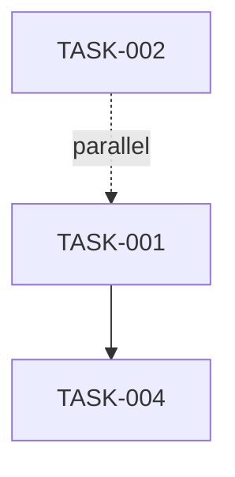
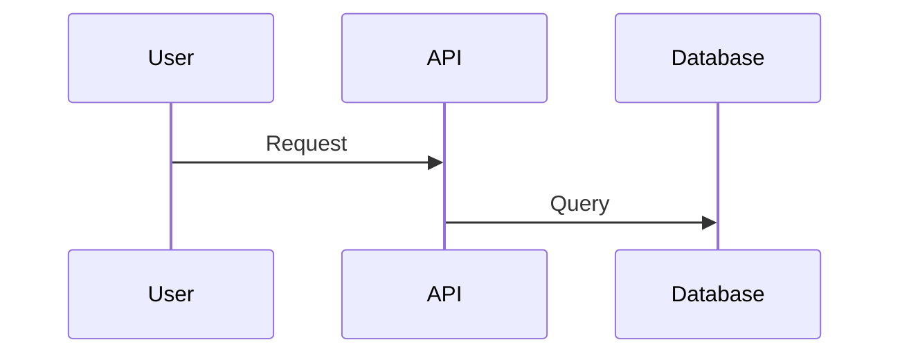

# Adapter Implementation & Developer Workflow Guide

## Table of Contents

1. [Overview](#overview)
2. [Architecture](#architecture)
3. [Current Implementation Status](#current-implementation-status)
4. [Format Analysis](#format-analysis)
5. [Developer Workflows](#developer-workflows)
6. [Technical Deep Dive](#technical-deep-dive)
7. [Adding New Adapters](#adding-new-adapters)
8. [CLI Integration](#cli-integration)
9. [Testing Strategy](#testing-strategy)
10. [Implementation Roadmap](#implementation-roadmap)

---

## Overview

### The Core Problem

Teams use different planning formats:

- **SpecKit**: GitHub's official spec-driven development format (3 documents:
  spec.md, plan.md, tasks.md)
- **BMAD**: AI-Agent Framework for Agile Development (multi-document: PRD,
  Architecture, Stories, QA)
- **Native APS**: Anvil's internal format (JSON/YAML)

Anvil cannot force everyone to adopt a new format.

### The Solution: Adapters as the Wedge

**Work with existing formats, use APS (Anvil Plan Specification) internally.**

```
User's Format (SpecKit/BMAD) → Adapter → APS → Gate → Adapter → User's Format
```

**Key Benefits:**

1. **Adoption**: Teams keep their existing workflows
2. **Consistency**: APS ensures validation works across all formats
3. **Collaboration**: Teams using different formats can work together
4. **Extensibility**: Easy to add new formats (ADR, RFC, etc.)

---

## Architecture

### Data Flow

```
┌─────────────────────────────────────────────────────────────┐
│                    USER'S WORLD                              │
│  • SpecKit files (spec.md, plan.md, tasks.md)               │
│  • BMAD files (PRD.md, architecture.md, stories/)           │
│  • Native APS (JSON/YAML)                                    │
└────────────────────────┬────────────────────────────────────┘
                         │
                         │ CLI Command: anvil gate plan.md
                         ↓
┌─────────────────────────────────────────────────────────────┐
│                 ADAPTER AUTO-DETECTION                       │
│                                                              │
│  Registry.detectAdapter(content) →                          │
│    - SpecKit: Checks for "# Feature:", "## User Scenarios"  │
│    - BMAD: Checks for "# Product Requirements", "FR-XXX"    │
│    - Returns: { adapter, confidence: 85% }                  │
└────────────────────────┬────────────────────────────────────┘
                         │
                         │ Selected: SpecKit Adapter
                         ↓
┌─────────────────────────────────────────────────────────────┐
│                  ADAPTER PARSE                               │
│                                                              │
│  SpecKitImportAdapter.parse(content) →                      │
│    1. Parse spec.md, plan.md, tasks.md                      │
│    2. Extract user scenarios → intent                       │
│    3. Extract tasks → proposed_changes[]                    │
│    4. Extract requirements → metadata                       │
│    5. Add provenance (timestamp, author, source)            │
│    6. Generate hash (SHA-256 of canonical form)             │
└────────────────────────┬────────────────────────────────────┘
                         │
                         │ APS Plan (Internal Format)
                         ↓
┌─────────────────────────────────────────────────────────────┐
│                    APS CORE VALIDATION                       │
│                                                              │
│  validatePlan(apsPlan) →                                     │
│    - Zod schema validation                                  │
│    - Hash verification                                      │
│    - Business rules (intent length, required fields)        │
│  Result: Valid APS ✅                                        │
└────────────────────────┬────────────────────────────────────┘
                         │
                         │ Validated APS
                         ↓
┌─────────────────────────────────────────────────────────────┐
│                    GATE VALIDATION                           │
│                                                              │
│  GateRunner.run(apsPlan) → (Parallel execution)             │
│    ├─ LintCheck: ESLint on proposed changes                 │
│    ├─ TestCheck: Run test suite                             │
│    ├─ CoverageCheck: Measure coverage                       │
│    ├─ SecretsCheck: Scan for API keys, tokens               │
│    └─ FormatValidation: Format-specific rules               │
│                                                              │
│  Evidence: { status: 'passed', checks: [...] }              │
└────────────────────────┬────────────────────────────────────┘
                         │
                         │ Evidence Bundle
                         ↓
┌─────────────────────────────────────────────────────────────┐
│                 ADAPTER SERIALIZE                            │
│                                                              │
│  SpecKitExportAdapter.serialize(apsPlan) →                  │
│    1. Generate spec.md, plan.md, tasks.md from APS          │
│    2. Inject evidence as markdown comment                   │
│    3. Preserve original formatting                          │
└────────────────────────┬────────────────────────────────────┘
                         │
                         │ Updated Format Files
                         ↓
┌─────────────────────────────────────────────────────────────┐
│                    USER'S WORLD                              │
│  • Original files updated with evidence                      │
│  • Gate status visible in documents                         │
│  • Plan ready for apply or rollback                         │
└─────────────────────────────────────────────────────────────┘
```

### Core Components

**1. Adapter Registry**

- Central hub for adapter discovery
- Auto-detection based on content analysis
- Format-specific adapter lookup

**2. Format Adapters**

- Import: Format → APS conversion
- Export: APS → Format conversion
- Detection: Content pattern matching
- Validation: Format-specific rules

**3. APS Core**

- Schema validation (Zod)
- Deterministic hashing
- Validation engine
- Evidence management

**4. Gate Runner**

- Quality gate execution
- Format-specific validators
- Evidence collection
- Status reporting

---

## Current Implementation Status

### ✅ Completed: SpecKit Adapter

**Location**: `packages/adapters/src/speckit/`

**Status**: ✅ **FULLY IMPLEMENTED** (October 2025)

- 51 tests (49 passing, 2 minor fixes needed)
- ~2,469 LOC
- > 95% coverage

**Files**:

- ✅ `parser.ts` - Core markdown parser (330 LOC)
- ✅ `import.ts` - V1 import adapter (284 LOC)
- ✅ `import-v2.ts` - V2 official format adapter (424 LOC)
- ✅ `export.ts` - Export adapter (462 LOC)
- ✅ `parsers/spec-parser.ts` - Spec.md parser (378 LOC)
- ✅ `parsers/plan-parser.ts` - Plan.md parser (342 LOC)
- ✅ `parsers/tasks-parser.ts` - Tasks.md parser (246 LOC)

**Capabilities**:

- ✅ Parse spec.md (user scenarios, requirements, entities, success criteria)
- ✅ Parse plan.md (technical context, constitution check, implementation
  details)
- ✅ Parse tasks.md (phases, dependencies, parallel execution)
- ✅ Convert to APS with full metadata preservation
- ✅ Export back to SpecKit format
- ✅ Evidence injection
- ✅ Round-trip fidelity (parse → serialize → parse preserves data)

**Known Gaps** (to be addressed in Phase 1):

- ⚠️ Constitution check not enforced in gate
- ⚠️ Clarification markers not validated
- ⚠️ Phase checkpoints not enforced
- ⚠️ Task dependencies not used in execution
- ❌ research.md not parsed
- ❌ data-model.md not parsed
- ❌ contracts/ not parsed

### ⏳ In Progress: BMAD Adapter

**Location**: `packages/adapters/src/bmad/` (to be created)

**Status**: ❌ **NOT IMPLEMENTED** (Planned for Phases 2-4)

**Planned Files**:

- ❌ `parser.ts` - Core YAML/markdown parser
- ❌ `prd-parser.ts` - PRD parser
- ❌ `architecture-parser.ts` - Architecture document parser
- ❌ `story-parser.ts` - Story file parser
- ❌ `qa-parser.ts` - QA assessment parser
- ❌ `import.ts` - BMAD → APS adapter
- ❌ `export.ts` - APS → BMAD adapter

**Planned Capabilities**:

- Parse PRD (goals, FR/NFR, epics, user stories)
- Parse Architecture (tech stack, data models, components, APIs)
- Parse individual story files
- Parse QA assessments and quality gates
- Multi-document support
- Master checklist validation
- PRD/Architecture alignment checks

### ✅ Completed: Core Infrastructure

**Adapter Framework** (`packages/adapters/src/base/`)

- ✅ FormatAdapter interface
- ✅ AdapterRegistry with auto-detection
- ✅ Testing utilities
- ~586 LOC, 22 tests (100% passing)

**APS Core** (`packages/core/`)

- ✅ Zod schema with full TypeScript types
- ✅ Deterministic hashing (SHA-256)
- ✅ Validation engine
- ✅ Comprehensive test coverage

**Gate v1** (`packages/gate/`)

- ✅ ESLint integration
- ✅ Test coverage checks
- ✅ Secret scanning
- ✅ Evidence collection

---

## Format Analysis

### SpecKit Format (GitHub Official)

**Philosophy**: Spec-Driven Development with AI agents **Use Case**: AI-assisted
feature development with clear WHAT/WHY/HOW separation

#### Document Structure

**spec.md** - Requirements (WHAT and WHY)

```markdown
# Feature: [Feature Name]

**Branch**: `feature/xxx-name` **Date**: YYYY-MM-DD **Status**: Draft | In
Progress | Review | Complete

## User Scenarios & Testing

### P1: [High Priority Scenario]

**As a** [user type] **I want to** [action] **So that** [benefit]

**Acceptance Scenarios:**

- Given [context], When [action], Then [outcome]

**Edge Cases:**

- [Edge case description]
- [NEEDS CLARIFICATION: question]

## Requirements

### Functional Requirements

**FR-001**: System MUST [requirement]

### Key Entities

**EntityName**

- Represents: [description]
- Key Attributes: [attr1, attr2]

## Success Criteria

### Quantitative Metrics

- [Measurable metric]
```

**plan.md** - Implementation (HOW)

```markdown
# Implementation Plan: [Feature Name]

## Technical Context

- **Language & Version**: [e.g., TypeScript 5.0]
- **Dependencies**: [key libraries]
- **Storage**: [database/storage approach]
- **Testing Framework**: [framework choice]

## Constitution Check

- **Phase**: Before Phase 0 / After Phase 1
- **Status**: ✅ PASSED / ⚠️ REVIEWED / ❌ BLOCKED
- **Notes**: [evaluation notes]

## Implementation Details

### Database Schema

[Schema details]

### API Endpoints

[Endpoint specifications]

## Complexity Tracking

| Complexity Item | Justification | Alternatives Rejected |
| --------------- | ------------- | --------------------- |
| [Item]          | [Why needed]  | [Why not simpler]     |
```

**tasks.md** - Execution Breakdown

````markdown
# Tasks: [Feature Name]

## Phase 1: Setup

- `TASK-001`: Initialize project structure
- `TASK-002` [~]: Configure linting (parallel)

## Phase 2: Foundational ⚠️ CRITICAL

- `TASK-004`: Set up database/ORM
- `TASK-005`: Implement authentication middleware

**Checkpoint**: Foundational infrastructure complete

## Phase 3: User Stories (P1)

### [STORY-001]: [User Story Title]

- `TASK-008`: [Task description]
- `TASK-009` [~]: [Parallel task]

## Dependencies & Execution Order


````

````

#### Key Characteristics
1. **Priority-Driven**: P1 (high), P2 (medium), P3+ (low)
2. **Clarification Markers**: `[NEEDS CLARIFICATION: ...]` for ambiguities
3. **Independent Testability**: Each user scenario independently testable
4. **Constitution Check**: Gating mechanism for architecture decisions
5. **Phase-Based Tasks**: Setup → Foundational → Stories → Polish
6. **Parallel Execution**: Tasks marked `[~]` can run in parallel

### BMAD Format

**Philosophy**: AI-Agent Framework for Agile Development
**Use Case**: Agent-driven planning with human-in-the-loop validation

#### Document Structure

**PRD (docs/prd.md)** - Product Requirements
```markdown
# Product Requirements Document
**Version**: 2.0
**Date**: YYYY-MM-DD

## Goals and Background Context
### Goals
- [Desired outcome 1]

### Background Context
[Problem explanation]

## Requirements
### Functional (FR)
**FR-001**: [Requirement description]

### Non-Functional (NFR)
**NFR-001**: [Requirement description]

## Epic List
1. **[Epic Title]**: [Single-sentence goal]

## Epic Details
### Epic 1: [Title]
**User Stories:**
- **US-001**: As a [user], I want [action], so that [benefit]

**Acceptance Criteria (US-001):**
1. [Testable condition]
````

**Architecture (docs/architecture.md)** - Technical Design

````markdown
# Architecture Document

**Version**: 2.0

## Tech Stack (DEFINITIVE - Single Source of Truth)

| Category | Technology | Version | Purpose        | Rationale             |
| -------- | ---------- | ------- | -------------- | --------------------- |
| Runtime  | Node.js    | 18.17.0 | Server runtime | LTS, widely supported |

## Data Models

### Model 1: [Entity Name]

**Attributes**:

- `id`: UUID, Primary Key
- `name`: string, required

**Relationships**:

- One-to-Many with [Other Entity]

## Components

### Component 1: [Component Name]

**Responsibility**: [Primary purpose] **Interfaces/APIs**:

- `POST /api/endpoint`: [Description]

## Core Workflows

### Workflow 1: [User Journey Name]


````

````

**Story Files (docs/stories/{epic}.{story}.md)**
```markdown
# Story: [Story Title]
**Epic**: [Epic Name]
**ID**: {epic}.{story}
**Priority**: P0 | P1 | P2

## User Story
As a [user type], I want [action], so that [benefit]

## Acceptance Criteria
1. Given [context], When [action], Then [outcome]

## Dev/QA Notes
[Notes that carry forward]
````

**QA Assessments (docs/qa/assessments/{epic}.{story}-risk-profile-YYYYMMDD.md)**

```markdown
# Risk Profile: {epic}.{story}

## Risk Assessment

| Risk Category | Probability (1-3) | Impact (1-3) | Score | Mitigation |
| ------------- | ----------------- | ------------ | ----- | ---------- |
| Security      | 2                 | 3            | 6     | [Strategy] |

## Test Strategy

### Unit Tests (P0)

- [Test description]

## Requirements Traceability

**FR-001**: [Requirement]

- **Test Coverage**: [How it's tested]
```

#### Key Characteristics

1. **Agent-Driven**: Analyst, PM, Architect, Dev, QA agents collaborate
2. **YAML Templates**: Documents generated from YAML with embedded prompts
3. **Validation Workflow**: Master checklist ensures PRD/Architecture alignment
4. **Document Sharding**: PRD/Architecture split into Epic/Story files
5. **QA Integration**: Built-in risk assessment and quality gates
6. **Traceability**: Requirements tracked through stories to tests
7. **Version Control**: Change logs in every document

---

## Developer Workflows

### Workflow 1: Plan Validation (SpecKit)

```bash
# User creates SpecKit feature spec
cat > specs/auth-feature/spec.md <<EOF
# Feature: Authentication
**Branch**: feature/auth
**Status**: Draft

## User Scenarios & Testing
### P1: User Login
**As a** registered user
**I want to** log in with email/password
**So that** I can access my account

**Acceptance Scenarios:**
- Given valid credentials, When I submit login form, Then I am logged in
EOF

# Create plan.md and tasks.md...

# Anvil detects format and validates
anvil gate specs/auth-feature/spec.md

# Behind the scenes:
# 1. AdapterRegistry.detectAdapter(content)
#    → Detects SpecKit (confidence: 92%)
#
# 2. SpecKitImportAdapter.parse(content)
#    → Converts to APS with full metadata
#
# 3. GateRunner.run(apsPlan)
#    → Runs checks:
#      - Lint: ✅ Passed
#      - Tests: ✅ Passed
#      - Coverage: ✅ 85%
#      - Constitution: ✅ PASSED
#      - Clarifications: ⚠️ 2 unresolved
#
# 4. SpecKitExportAdapter.serialize(apsPlanWithEvidence)
#    → Injects evidence into spec.md:
#      <!-- ANVIL EVIDENCE
#      Gate Status: WARNING
#      Constitution: ✅ PASSED
#      Clarifications: ⚠️ 2 unresolved
#      Checks: All passed
#      -->
#
# Output:
# ⚠️  Gate Validation: WARNING
# ✅ All checks passed
# ⚠️ 2 clarifications need resolution
```

### Workflow 2: Format Conversion

```bash
# User has SpecKit spec but team uses BMAD
anvil convert specs/auth-feature/spec.md --to bmad

# Behind the scenes:
# 1. SpecKitImportAdapter.parse() → APS
# 2. BMADExportAdapter.serialize() → docs/prd.md, docs/architecture.md
#
# Output: BMAD files created with same intent

# Round-trip conversion preserves data
anvil convert docs/prd.md --to speckit
# → Regenerates specs/auth-feature/ with same APS hash
```

### Workflow 3: Multi-Format Team Collaboration

```bash
# Developer 1 (SpecKit user)
anvil plan "Add auth" --format speckit
# → Generates spec.md, plan.md, tasks.md

anvil gate specs/auth-feature/spec.md
# → Validates in SpecKit format

# PM (BMAD user) needs to review
anvil convert specs/auth-feature/spec.md --to bmad
# → Output: docs/prd.md

# PM edits PRD, adds NFRs
vim docs/prd.md

# Developer 2 needs latest from PM
anvil convert docs/prd.md --to speckit
# → Updates specs/auth-feature/ with PM's changes

# Everyone works in their preferred format!
# APS ensures consistency across formats.
```

### Workflow 4: CI/CD Integration

```yaml
# .github/workflows/anvil-gate.yml
name: Anvil Gate

on:
  pull_request:
    paths:
      - 'specs/**'
      - 'docs/prds/**'

jobs:
  validate:
    runs-on: ubuntu-latest
    steps:
      - uses: actions/checkout@v3

      - name: Run Anvil Gate
        uses: anvil/gate-action@v1
        with:
          plan: 'specs/auth-feature/spec.md' # Auto-detects format


      # Posts gate results as PR comment
```

---

## Technical Deep Dive

### Adapter Registry Pattern

**Purpose**: Central hub for adapter discovery and selection

**Key Methods**:

```typescript
// Registration (at startup)
import { registry } from '@anvil/adapters';
import { SpecKitImportAdapter, BMADImportAdapter } from '@anvil/adapters';

registry.register(new SpecKitImportAdapter());
registry.register(new BMADImportAdapter());

// Auto-detection (by content analysis)
const content = await fs.readFile('plan.md', 'utf-8');
const match = registry.detectAdapter(content);
// → { adapter: SpecKitImportAdapter, detection: { confidence: 92% } }

// Explicit lookup (by format name)
const adapter = registry.getAdapterForFormat('speckit-v2');

// All adapters supporting a format
const importers = registry.getImportAdapters('.md');
```

**Detection Algorithm** (SpecKit example):

```typescript
class SpecKitImportAdapter extends BaseFormatAdapter {
  detect(content: string): DetectionResult {
    const indicators = [
      { pattern: /# Feature:/i, weight: 25 },
      { pattern: /## User Scenarios & Testing/i, weight: 20 },
      { pattern: /\*\*As a\*\*/i, weight: 15 },
      { pattern: /\*\*I want to\*\*/i, weight: 15 },
      { pattern: /\*\*So that\*\*/i, weight: 15 },
      { pattern: /TASK-\d{3}/g, weight: 10 },
    ];

    let score = 0;
    const matches: string[] = [];

    for (const { pattern, weight } of indicators) {
      if (pattern.test(content)) {
        score += weight;
        matches.push(pattern.source);
      }
    }

    return {
      detected: score >= 50,
      confidence: Math.min(score, 100),
      reason: `Matched ${matches.length}/${indicators.length} SpecKit indicators`,
    };
  }
}
```

### Parse Flow (SpecKit → APS)

```typescript
// 1. Entry point
const adapter = new SpecKitImportAdapter();
const result = await adapter.parse(content, context, options);

// 2. Parse each document
const specData = specParser.parseSpec(content);
// → { scenarios, requirements, entities, successCriteria }

const planData = planParser.parsePlan(content);
// → { technicalContext, constitutionCheck, implementationDetails }

const tasksData = tasksParser.parseTasks(content);
// → { phases, tasks, dependencies }

// 3. Convert to APS
const apsPlan = {
  id: `aps-${generateId()}`,
  intent: buildIntentFromScenarios(specData.scenarios),
  proposed_changes: buildChangesFromTasks(tasksData.tasks),
  metadata: {
    source_format: 'speckit-v2',
    userScenarios: specData.scenarios,
    requirements: specData.requirements,
    constitutionCheck: planData.constitutionCheck,
    phases: tasksData.phases,
    taskDependencies: tasksData.dependencies,
  },
  provenance: {
    timestamp: context.timestamp,
    source: 'speckit-v2',
    version: '2.0.0',
    author: context.author,
  },
};

// 4. Generate deterministic hash
apsPlan.hash = generateHash(canonicalize(apsPlan));

return {
  success: true,
  data: apsPlan,
  warnings: warnings.length > 0 ? warnings : undefined,
};
```

### Serialize Flow (APS → SpecKit)

```typescript
class SpecKitExportAdapter extends BaseFormatAdapter {
  async serialize(
    plan: APSPlan,
    options?: AdapterOptions
  ): Promise<SerializeResult> {
    // Generate each document
    const specMd = specGenerator.generateSpec(plan);
    const planMd = planGenerator.generatePlan(plan);
    const tasksMd = tasksGenerator.generateTasks(plan);

    // Inject evidence if present
    if (plan.evidence && plan.evidence.length > 0) {
      specMd = injectEvidence(specMd, plan.evidence[plan.evidence.length - 1]);
    }

    return {
      success: true,
      content: specMd,
      metadata: {
        generatedFiles: ['spec.md', 'plan.md', 'tasks.md'],
      },
    };
  }

  private injectEvidence(content: string, evidence: Evidence): string {
    const evidenceComment = `<!-- ANVIL EVIDENCE
Gate Status: ${evidence.overall_status.toUpperCase()}
Timestamp: ${evidence.timestamp}
Plan Hash: ${plan.hash}
Checks:
${evidence.checks.map((c) => `  - ${c.name}: ${c.status === 'passed' ? '✅' : '❌'} ${c.status}`).join('\n')}
-->`;

    return `${content}\n\n${evidenceComment}`;
  }
}
```

### Round-Trip Fidelity

```typescript
describe('SpecKit Round-trip', () => {
  it('should preserve all data through full cycle', async () => {
    // 1. Original SpecKit
    const original = await readFixture('auth-feature/spec.md');

    // 2. Parse to APS
    const result1 = await adapter.parse(original);
    const aps1 = result1.data!;

    // 3. Serialize back to SpecKit
    const result2 = await adapter.serialize(aps1);
    const regenerated = result2.content!;

    // 4. Parse again
    const result3 = await adapter.parse(regenerated);
    const aps2 = result3.data!;

    // 5. Verify identical
    expect(aps2.hash).toBe(aps1.hash);
    expect(aps2.intent).toBe(aps1.intent);
    expect(aps2.proposed_changes).toEqual(aps1.proposed_changes);
  });
});
```

---

## Adding New Adapters

### Step-by-Step Guide (Example: ADR Format)

**1. Create Adapter Directory**

```bash
mkdir -p packages/adapters/src/adr
```

**2. Implement Parser**

```typescript
// adr/parser.ts
interface ParsedADR {
  title?: string;
  status?: 'proposed' | 'accepted' | 'deprecated';
  context?: string;
  decision?: string;
  consequences?: Array<{ type: string; description: string }>;
}

export class ADRParser {
  parseADRMarkdown(content: string): ParsedADR {
    const sections = this.parseMarkdownSections(content);
    // Extract title, status, context, decision, consequences
    return result;
  }
}
```

**3. Implement Import Adapter**

```typescript
// adr/import.ts
export class ADRImportAdapter extends BaseFormatAdapter {
  readonly metadata: AdapterMetadata = {
    name: 'adr',
    version: '1.0.0',
    displayName: 'Architecture Decision Record',
    extensions: ['.adr.md', '.md'],
    formats: ['adr'],
  };

  detect(content: string): DetectionResult {
    const indicators = [
      { pattern: /# ADR-\d{3}:/i, weight: 30 },
      { pattern: /## Status.*\n.*(?:Proposed|Accepted)/i, weight: 25 },
      { pattern: /## Context/i, weight: 15 },
      { pattern: /## Decision/i, weight: 20 },
      { pattern: /## Consequences/i, weight: 10 },
    ];

    let score = 0;
    for (const { pattern, weight } of indicators) {
      if (pattern.test(content)) score += weight;
    }

    return {
      detected: score >= 50,
      confidence: Math.min(score, 100),
      reason: `Matched ADR indicators (score: ${score})`,
    };
  }

  async parse(content: string, context?: ParseContext): Promise<ParseResult> {
    const parsed = this.parser.parseADRMarkdown(content);
    const plan = this.convertToAPS(parsed, context);
    return this.createParseSuccess(plan);
  }

  private convertToAPS(parsed: ParsedADR, context?: ParseContext): APSPlan {
    const intent = `${parsed.title}: ${parsed.decision}`;
    const changes: ProposedChange[] = [
      {
        type: 'documentation',
        description: parsed.decision || 'Architecture decision',
        path: 'docs/architecture/',
      },
    ];

    return createPlan({
      id: `aps-${generateId()}`,
      intent,
      provenance: this.buildProvenance(context),
      changes,
      metadata: {
        source_format: 'adr',
        status: parsed.status,
        context: parsed.context,
        consequences: parsed.consequences,
      },
    });
  }
}
```

**4. Implement Export Adapter**

```typescript
// adr/export.ts
export class ADRExportAdapter extends BaseFormatAdapter {
  async serialize(plan: APSPlan): Promise<SerializeResult> {
    const markdown = this.generateADRMarkdown(plan);
    return { success: true, content: markdown };
  }

  private generateADRMarkdown(plan: APSPlan): string {
    const sections: string[] = [];
    sections.push(`# ADR-${plan.metadata?.adrNumber || '001'}: ${plan.intent}`);
    sections.push('');
    sections.push('## Status');
    sections.push(plan.metadata?.status || 'Proposed');
    sections.push('');
    sections.push('## Context');
    sections.push(plan.metadata?.context || '');
    // ... more sections
    return sections.join('\n');
  }
}
```

**5. Register Adapter**

```typescript
// packages/adapters/src/index.ts
export { ADRImportAdapter, ADRExportAdapter } from './adr/index.js';

// CLI or application startup
import { registry } from '@anvil/adapters';
import { ADRImportAdapter } from '@anvil/adapters/adr';

registry.register(new ADRImportAdapter());
```

**6. Write Tests**

```typescript
describe('ADRImportAdapter', () => {
  it('should detect valid ADR documents', () => {
    const content = `# ADR-001: Use TypeScript\n\n## Status\n\nAccepted`;
    const result = adapter.detect(content);
    expect(result.detected).toBe(true);
    expect(result.confidence).toBeGreaterThan(70);
  });

  it('should parse ADR to APS', async () => {
    const content = await readFixture('adr/sample.md');
    const result = await adapter.parse(content);
    expect(result.success).toBe(true);
    expect(result.data?.intent).toContain('TypeScript');
  });
});
```

**7. Document Adapter** Update `packages/adapters/README.md` with ADR format
details.

---

## CLI Integration

### How CLI Uses Adapters

**Command: `anvil gate`**

```typescript
// cli/src/commands/gate.ts
async function gateCommand(planFile: string, options: GateOptions) {
  // 1. Read file
  const content = await fs.readFile(planFile, 'utf-8');

  // 2. Auto-detect format
  const match = registry.detectAdapter(content, options.minConfidence || 50);
  if (!match) {
    console.error('❌ Unable to detect plan format');
    process.exit(1);
  }

  console.log(
    `📋 Detected: ${match.adapter.metadata.displayName} (${match.detection.confidence}%)`
  );

  // 3. Parse to APS
  const parseResult = await match.adapter.parse(content, {
    repositoryPath: process.cwd(),
    branch: await getCurrentBranch(),
    commit: await getLatestCommit(),
    author: await getGitUser(),
  });

  if (!parseResult.success) {
    console.error('❌ Failed to parse plan');
    process.exit(1);
  }

  const apsPlan = parseResult.data!;

  // 4. Run gate validation
  const gateRunner = new GateRunner(options.gateConfig);
  const gateResult = await gateRunner.run(apsPlan);

  // 5. Add evidence
  apsPlan.evidence = apsPlan.evidence || [];
  apsPlan.evidence.push(gateResult.evidence);

  // 6. Serialize back
  const serializeResult = await match.adapter.serialize(apsPlan);
  if (serializeResult.success) {
    await fs.writeFile(planFile, serializeResult.content!, 'utf-8');
  }

  // 7. Display results
  displayGateResults(gateResult);

  process.exit(gateResult.overall_status === 'passed' ? 0 : 1);
}
```

**Command: `anvil convert`**

```typescript
async function convertCommand(inputFile: string, options: ConvertOptions) {
  const content = await fs.readFile(inputFile, 'utf-8');

  // Auto-detect source
  const sourceMatch = registry.detectAdapter(content);
  if (!sourceMatch) {
    console.error('❌ Unable to detect source format');
    process.exit(1);
  }

  // Parse to APS
  const parseResult = await sourceMatch.adapter.parse(content);
  const apsPlan = parseResult.data!;

  // Get target adapter
  const targetAdapter = registry.getAdapterForFormat(options.to);
  if (!targetAdapter) {
    console.error(`❌ Unknown target format: ${options.to}`);
    process.exit(1);
  }

  // Serialize to target
  const serializeResult = await targetAdapter.serialize(apsPlan);

  // Write output
  const outputFile =
    options.output || generateOutputFilename(inputFile, options.to);
  await fs.writeFile(outputFile, serializeResult.content!, 'utf-8');

  console.log(`✅ Converted to ${outputFile}`);
}
```

---

## Testing Strategy

### Test Levels

**1. Unit Tests** (Parser/Generator)

```typescript
describe('SpecParser', () => {
  it('should extract user scenarios', () => {
    const content = '## User Scenarios & Testing\n### P1: Login\n**As a** user';
    const result = parser.parseSpec(content);
    expect(result.scenarios).toHaveLength(1);
    expect(result.scenarios[0].priority).toBe('P1');
  });
});
```

**2. Integration Tests** (Adapter)

```typescript
describe('SpecKit Adapter Integration', () => {
  it('should convert SpecKit to APS', async () => {
    const spec = await readFixture('auth-feature/spec.md');
    const result = await adapter.parse(spec);
    expect(result.success).toBe(true);
    expect(result.data?.proposed_changes.length).toBeGreaterThan(0);
  });
});
```

**3. Round-Trip Tests**

```typescript
describe('Round-trip Conversion', () => {
  it('should preserve data through SpecKit → APS → SpecKit', async () => {
    const original = await readFixture('auth-feature/spec.md');
    const aps1 = await adapter.parse(original);
    const regenerated = await adapter.serialize(aps1.data);
    const aps2 = await adapter.parse(regenerated.content);

    expect(aps2.data.hash).toBe(aps1.data.hash);
  });
});
```

**4. Format Validation Tests**

```typescript
describe('Format Validation', () => {
  it('should fail on invalid SpecKit format', async () => {
    const invalid = 'Not a valid SpecKit spec';
    const result = await adapter.validate(invalid);
    expect(result.valid).toBe(false);
  });
});
```

**5. Golden Tests** (Hash Stability)

```typescript
describe('Hash Determinism', () => {
  it('should generate same hash for same content', async () => {
    const content = await readFixture('auth-feature/spec.md');
    const hashes = [];

    for (let i = 0; i < 10; i++) {
      const result = await adapter.parse(content);
      hashes.push(result.data!.hash);
    }

    expect(new Set(hashes).size).toBe(1);
  });
});
```

### Test Fixtures

```
__tests__/fixtures/
├── speckit/
│   ├── auth-feature/
│   │   ├── spec.md
│   │   ├── plan.md
│   │   └── tasks.md
│   ├── minimal-feature/
│   │   └── spec.md
│   └── invalid-feature/
│       └── spec.md
├── bmad/
│   ├── complete-project/
│   │   ├── prd.md
│   │   ├── architecture.md
│   │   └── stories/
│   └── minimal-project/
│       └── prd.md
└── aps/
    └── expected/
        ├── auth-feature.aps.json
        └── minimal-feature.aps.json
```

---

## Implementation Roadmap

### Phase 1: SpecKit Enhancement (Week 1-2)

**Goals**: Complete SpecKit adapter with all features

**Tasks**:

1. ✅ Fix 2 failing tests (2 hours)
2. ⏳ Add format-specific validators (1 day)
   - Constitution check validator
   - Clarification validator
   - Checkpoint validator
3. ⏳ Parse additional documents (1 day)
   - research.md
   - data-model.md
   - contracts/\*.md
4. ⏳ Enhance template generators (0.5 days)
5. ⏳ Integration testing (1 day)

**Deliverables**:

- ✅ All 51 tests passing
- ✅ 100% coverage
- ✅ Complete SpecKit adapter

### Phase 2: BMAD Foundation (Week 3-4)

**Goals**: Implement core BMAD parsing

**Tasks**:

1. PRD parser (2 days)
2. Architecture parser (2 days)
3. BMAD import adapter (2 days)
4. BMAD export adapter (2 days)
5. Testing (1 day)

**Deliverables**:

- ✅ PRD ↔ APS conversion
- ✅ Architecture ↔ APS conversion
- ✅ >95% coverage

### Phase 3: BMAD Advanced (Week 5-6)

**Goals**: Story sharding and QA integration

**Tasks**:

1. Story/Epic parsers (1 day)
2. QA parsers (1 day)
3. Multi-document support (2 days)
4. Agent workflow support (1 day)
5. Testing (1 day)

**Deliverables**:

- ✅ Document sharding
- ✅ QA integration
- ✅ Multi-document parsing

### Phase 4: BMAD Validation (Week 7)

**Goals**: Format-specific validation

**Tasks**:

1. Master checklist validator (1 day)
2. Alignment validator (1 day)
3. QA gate validator (1 day)
4. Gate integration (1 day)
5. Testing (1 day)

**Deliverables**:

- ✅ All validators working
- ✅ Gate integration complete

### Phase 5: Polish & Documentation (Week 8)

**Goals**: Documentation and examples

**Tasks**:

1. Documentation updates (1 day)
2. Example projects (1 day)
3. CLI integration (1 day)
4. Performance optimization (1 day)
5. Final testing (1 day)

**Deliverables**:

- ✅ Complete documentation
- ✅ Example projects
- ✅ CLI fully integrated

---

## Summary

### Key Takeaways

**For Developers Using Anvil**:

1. You never see APS unless you want to
2. Work in your preferred format (SpecKit, BMAD, etc.)
3. Anvil auto-detects format and handles conversion
4. Evidence is injected back into your format
5. Round-trip conversion preserves all data
6. Teams can collaborate across formats

**For Developers Building Adapters**:

1. Follow the established pattern: Parser → Import → Export
2. Reuse common utilities from shared/ folder
3. Implement all required methods: `detect()`, `parse()`, `serialize()`,
   `validate()`
4. Write comprehensive tests: unit, integration, round-trip, golden
5. Register with registry for auto-detection
6. Document format mappings clearly

**Architecture Principles**:

1. **APS is internal only** - Users never forced to adopt new format
2. **Adapters are the wedge** - Make Anvil adoptable
3. **Deterministic hashing** - Same content = same hash
4. **Immutable evidence** - Append-only audit trail
5. **Round-trip fidelity** - Parse → Serialize → Parse preserves intent
6. **Format agnostic** - Core works on APS, not specific formats

This adapter system enables Anvil to scale from developers (Act 1) to knowledge
workers (Act 2) to enterprise platform (Act 3). Same architecture, different
formats!
